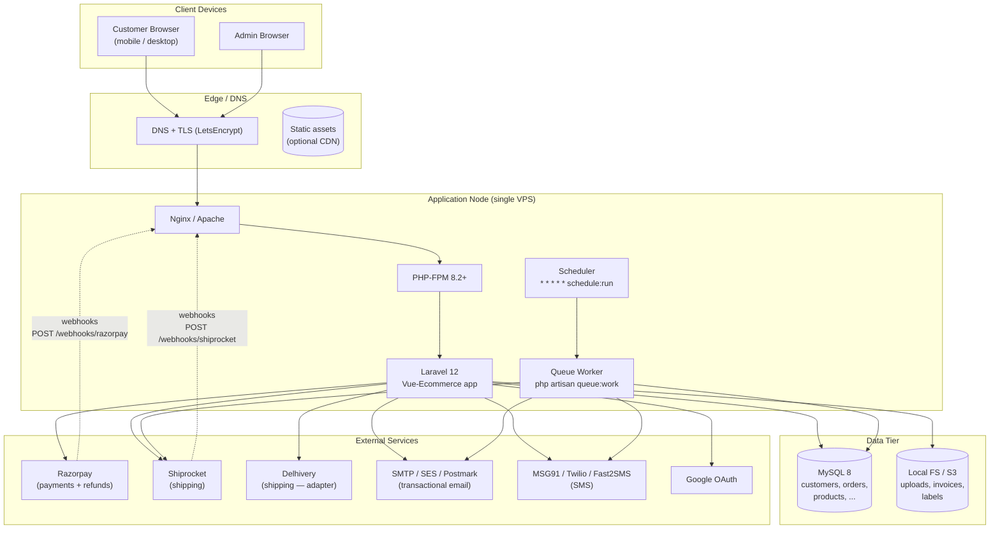
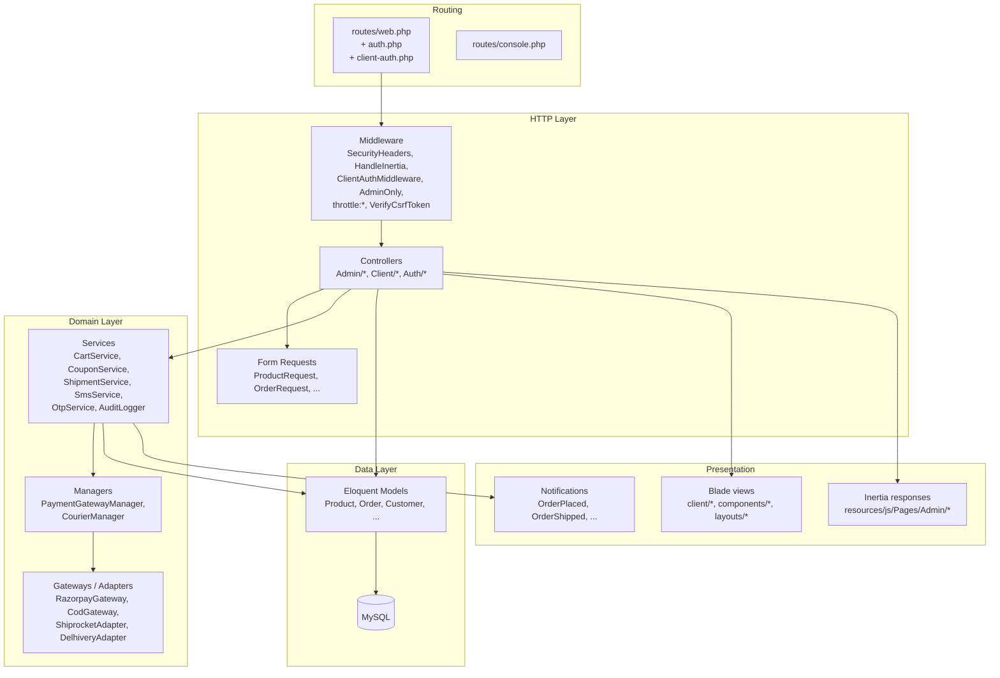
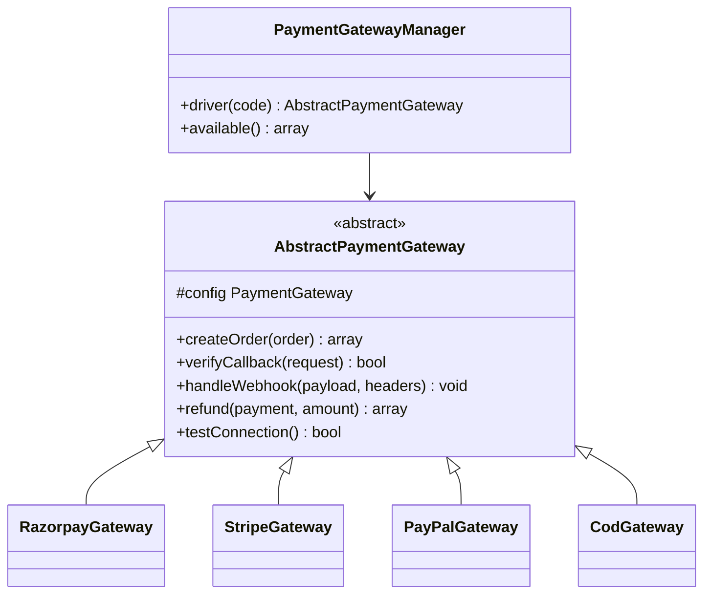
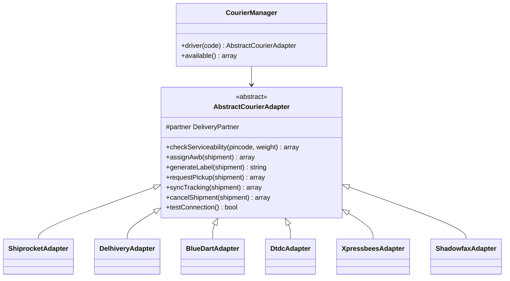
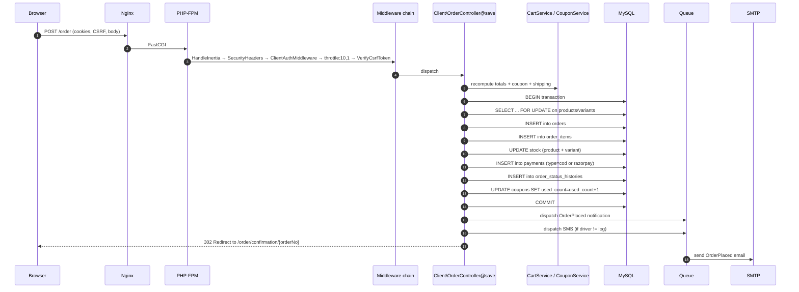
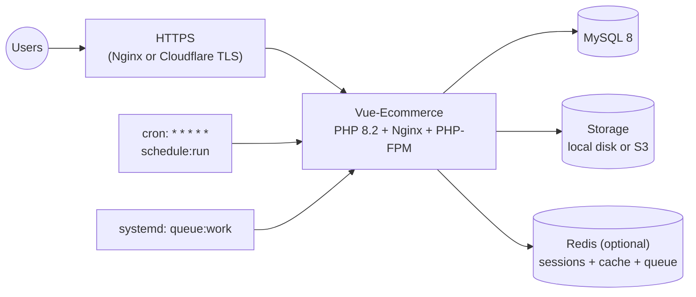

# 04 — System Architecture

## 1. High-level architecture

The design intentionally targets a **single-node** deployment. Redis, load balancers, and multiple app nodes are all optional upgrades that require only config changes (session driver, cache driver, queue driver) — no code changes.

---

## 2. Runtime processes

| Process       | Command                                       | Purpose                                                        | Cardinality |
| ------------- | --------------------------------------------- | -------------------------------------------------------------- | ----------- |
| Web           | `php-fpm` behind Nginx/Apache                 | HTTP requests (customer + admin + webhooks)                    | N workers   |
| Queue worker  | `php artisan queue:work --tries=3 --timeout=90` | Notifications, `SyncActiveShipmentsJob`, any queued job         | 1 (min)     |
| Scheduler     | `* * * * * php artisan schedule:run`          | Kicks off cron-registered work (tracking sync every 15 min)    | 1           |

All three are required in production. Missing the scheduler means tracking will only update via webhooks, missing the worker means emails and SMS never send.

---

## 3. Application layers

**Layer responsibilities:**

- **Routing** — HTTP + Artisan entry points. All customer/admin URLs live in `routes/web.php` (auth split into `auth.php` and `client-auth.php` for organisation).
- **Middleware** — Cross-cutting concerns. See [15 Security](15-security-architecture.md).
- **Controllers** — Thin. Validate via FormRequest, call a service, return a view/Inertia/JSON response. No business logic in controllers.
- **Form Requests** — All input validation lives here (23 requests — see [22 Folder Structure](22-folder-structure.md)).
- **Services** — Business logic. Stateful only via injected dependencies (session, DB).
- **Managers** — Factories that resolve the right gateway/adapter for a given code (`razorpay`, `shiprocket`, …).
- **Gateways/Adapters** — Third-party API integration. Implement a common contract.
- **Models** — Eloquent. Casts, relationships, scopes. Business rules that touch DB are here (e.g. `Product::decrementStock()` — where appropriate).
- **Notifications** — All `implements ShouldQueue`. Never called synchronously from a controller.
- **Presentation** — Blade for storefront (SEO-friendly server render), Inertia+Vue for admin (SPA-like).

---

## 4. Dual UI architecture (Inertia vs Blade)

This project intentionally mixes two rendering strategies. It is not a mistake; it is a deliberate optimisation:

| Concern        | Storefront (Blade)                                 | Admin (Inertia + Vue)                                     |
| -------------- | -------------------------------------------------- | --------------------------------------------------------- |
| Rendering      | Full HTML from PHP                                 | JSON payload → Vue component                              |
| SEO            | Perfect (server-rendered)                          | N/A (admin isn't indexed)                                 |
| First paint    | Fast (no JS boot)                                  | Fast enough (Inertia hydration)                           |
| Interactions   | jQuery-based, page reloads for most                | SPA — no page reloads except for auth                     |
| Development    | Familiar Laravel Blade                             | Modern Vue SFC with Tailwind, TypeScript-ready            |
| Where used     | `/`, `/shop`, `/product-detail/*`, `/checkout`, …  | Everything under `/admin/*`                               |

The bridge is `resources/js/app.js`, which sets up:
- Vue app + Inertia progress bar.
- Route resolution via `Ziggy` (so `route('admin.products')` works in Vue).
- Global CSRF injection.

---

## 5. Payment gateway architecture (extension point)

Pluggable via `PaymentGatewayManager`.

Adding a new gateway = 1 subclass + 1 row in `payment_gateways`. See [10 Payment Architecture](10-payment-architecture.md).

---

## 6. Courier adapter architecture (extension point)

Same shape as payments.

Only `Shiprocket` is live. See [11 Courier Architecture](11-courier-architecture.md).

---

## 7. Request lifecycle example — `POST /order`

The commit-then-dispatch pattern guarantees notifications only fire for orders that survived DB constraints.

---

## 8. Domain services (business logic hotspots)

### 8.1 `CartService`
- Session key: `cart` (array keyed by `productId:variantId`).
- Methods: `add()`, `update()`, `remove()`, `count()`, `items()`, `totals()`, `clear()`.
- Totals are always **recomputed from live DB prices** — never trusted from session.

### 8.2 `CouponService`
- `validate(code, customer, subtotal)` — checks active flag, dates, min-order, per-customer scope, usage-limit.
- `apply(order, coupon)` — computes and locks discount.
- `consume(coupon)` — atomic `UPDATE coupons SET used_count = used_count + 1 WHERE id = ? AND (usage_limit IS NULL OR used_count < usage_limit)`.

### 8.3 `ShipmentService`
- `create(order, partner)` — Creates Shipment row.
- `assignAwb(shipment)` — Calls adapter; on success, updates `awb_code`, `courier_id`, `label_url`, `tracking_url` and calls `notifyCustomerShipped()`.
- `notifyCustomerShipped(shipment)` — Guarded by `meta.ship_notified_at` — sends mail + SMS once.

### 8.4 `SmsService`
- Multi-driver (msg91, fast2sms, twilio, log).
- `send(to, message, template?)`.
- Log driver writes to `laravel.log` for local dev.

### 8.5 `OtpService`
- `issue(email)` — 6-digit code, persisted in `password_resets`.
- `verify(email, code)` — `hash_equals` constant-time compare.

### 8.6 `AuditLogger`
- `log(action, subject, changes)` — writes `admin_activity_logs` row with IP, UA, JSON diff.

---

## 9. Deployment topology (production)

Detailed steps in [17 Deployment Guide](17-deployment-guide.md).

---

## 10. Extensibility contracts

To add:

- **A payment gateway**: subclass `AbstractPaymentGateway`, register in `PaymentGatewayManager::$drivers`, seed a row in `payment_gateways`, add its UI card in `Pages/Admin/Settings/PaymentGateways/`.
- **A courier**: subclass `AbstractCourierAdapter`, register in `CourierManager::$drivers`, seed a row in `delivery_partners`.
- **A notification channel**: implement the Laravel `Notification` contract (`via()`, `toMail()`, `toSms()`, `toDatabase()`); add channel to `via()` of the relevant notification class.
- **A queued background task**: create in `app/Jobs/`, dispatch from a controller or service; add to `routes/console.php` `Schedule::job(...)` if recurring.
