# 05 — Database Schema & ERD

**Database:** MySQL 8 (default) — SQLite / PostgreSQL / SQL Server also supported by Laravel config.
**Charset:** `utf8mb4` / `utf8mb4_unicode_ci`.
**Migrations:** `database/migrations/*` — apply with `php artisan migrate`.
**Seeders:** `database/seeders/*` — apply with `php artisan db:seed`.

---

## 1. Entity-Relationship Diagram (ERD)

```mermaid
erDiagram
    users ||--o{ admin_activity_logs : "writes"
    customers ||--o{ customer_addresses : "has"
    customers ||--o{ orders : "places"
    customers ||--o{ wishlists : "saves"
    customers ||--o{ reviews : "writes"
    customers ||--o{ coupons : "scoped to (optional)"

    categories ||--o{ product_categories : ""
    categories ||--o{ categories : "parent_of"
    products ||--o{ product_categories : ""
    products ||--o{ product_variants : "has"
    products ||--o{ product_medias : "has"
    products ||--o{ reviews : "receives"
    products ||--o{ wishlists : ""
    product_variants ||--o{ product_variant_values : ""
    product_variants ||--o{ order_items : ""
    product_variants ||--o{ wishlists : ""
    attributes ||--o{ attribute_values : "has"
    attribute_values ||--o{ product_variant_values : ""
    attributes ||--o{ product_variant_values : ""

    orders ||--|{ order_items : "contains"
    orders ||--|| payments : "settled by"
    orders ||--o{ shipments : "dispatched via"
    orders ||--o{ order_status_histories : "audits"
    orders ||--o{ returns : "may have"

    delivery_partners ||--o{ shipments : ""
    delivery_partners ||--o{ orders : "default_for"
    shipments ||--o{ order_status_histories : ""

    returns ||--|{ return_items : ""
    order_items ||--o{ return_items : ""

    payment_gateways ||--o{ payments : "processed by"

    sliders ||--o{ slider_media : "has"

    users {
        bigint id PK
        varchar name
        varchar email UK
        varchar password
        varchar phone
        enum role "admin | user"
        tinyint is_active
    }
    customers {
        bigint id PK
        varchar name
        varchar email UK
        varchar phone UK
        varchar password
        varchar google_id
        varchar provider
        timestamp email_verified_at
        timestamp phone_verified_at
    }
    customer_addresses {
        bigint id PK
        bigint customer_id FK
        varchar name
        varchar phone
        varchar city
        varchar pincode
        varchar state
        varchar address
        enum type "home | work"
    }
    products {
        bigint id PK
        varchar name
        varchar slug
        text short_description
        text description
        varchar brand
        json sizes
        json color
        decimal price
        decimal compere_price
        uint stock
        decimal weight
        varchar sku
        tinyint status
        tinyint featured
        bool has_variants
        json option_types
        timestamp deleted_at
    }
    product_variants {
        bigint id PK
        bigint product_id FK
        varchar sku
        varchar barcode
        decimal price
        decimal compare_price
        uint stock
        decimal weight
        varchar image_url
        bool is_default
        bool status
        json options
        timestamp deleted_at
    }
    product_medias {
        bigint id PK
        bigint product_id FK
        bigint product_variant_id FK
        varchar url
        varchar alt_text
        enum type "image | video"
        bool is_primary
        uint priority
    }
    categories {
        bigint id PK
        bigint parent_id FK
        varchar name
        varchar slug
        varchar image
        tinyint status
        tinyint featured
    }
    product_categories {
        bigint id PK
        bigint product_id FK
        bigint category_id FK
    }
    attributes {
        bigint id PK
        varchar name
        varchar code UK
        enum swatch_type "none | color | image"
    }
    attribute_values {
        bigint id PK
        bigint attribute_id FK
        varchar value
        varchar label
        varchar swatch_value
    }
    product_variant_values {
        bigint id PK
        bigint product_variant_id FK
        bigint attribute_id FK
        bigint attribute_value_id FK
    }
    orders {
        bigint id PK
        bigint customer_id FK
        bigint delivery_partner_id FK
        varchar order_no UK
        decimal sub_total
        decimal shipping
        decimal discount
        varchar coupan_code
        decimal total
        enum status "pending | confirmed | delivered | canceled"
        varchar shipping_name
        varchar shipping_phone
        varchar shipping_pincode
        varchar shipping_address
        timestamp deleted_at
    }
    order_items {
        bigint id PK
        bigint order_id FK
        bigint product_id FK
        bigint product_variant_id FK
        uint quantity
        varchar size
        varchar color
        decimal price
        json variant_options
        varchar product_name_snapshot
        varchar variant_sku_snapshot
    }
    payments {
        bigint id PK
        bigint order_id FK
        varchar type "cod | razorpay | stripe | paypal"
        varchar payment_id
        varchar refund_id
        varchar status "pending | paid | failed"
        decimal amount
        decimal refunded_amount
        json meta
    }
    payment_gateways {
        bigint id PK
        varchar code UK
        varchar name
        enum mode "test | live"
        bool is_active
        bool is_default
        text credentials "encrypted JSON"
        json config
        json supports
        uint priority
    }
    delivery_partners {
        bigint id PK
        varchar name
        varchar code UK
        bool is_third_party
        bool is_active
        bool is_default
        enum mode "test | live"
        text credentials "encrypted JSON"
        json config
        json supports
        uint priority
    }
    shipments {
        bigint id PK
        bigint order_id FK
        bigint delivery_partner_id FK
        varchar provider
        varchar awb_code
        varchar courier_name
        varchar tracking_url
        varchar label_url
        varchar status
        timestamp shipped_at
        timestamp delivered_at
        json meta
    }
    order_status_histories {
        bigint id PK
        bigint order_id FK
        bigint shipment_id FK
        varchar status
        varchar source "system | admin | webhook | customer"
        varchar comment
        json meta
    }
    returns {
        bigint id PK
        varchar return_no UK
        bigint order_id FK
        bigint customer_id FK
        varchar status "requested | approved | rejected | received | refunded | cancelled"
        varchar reason
        decimal refund_amount
        bool restock_on_receipt
        timestamp requested_at
        timestamp approved_at
        timestamp received_at
        timestamp refunded_at
    }
    return_items {
        bigint id PK
        bigint return_id FK
        bigint order_item_id FK
        uint quantity
        decimal unit_price
    }
    coupons {
        bigint id PK
        varchar code UK
        enum type "fixed | percent"
        decimal value
        decimal min_order_amount
        decimal max_discount_amount
        uint usage_limit
        uint used_count
        bigint customer_id FK
        timestamp starts_at
        timestamp expires_at
        bool is_active
    }
    wishlists {
        bigint id PK
        bigint customer_id FK
        bigint product_id FK
        bigint variant_id FK
    }
    reviews {
        bigint id PK
        bigint product_id FK
        bigint customer_id
        uint rate
        varchar title
        text review
        varchar image
        bool is_approved
        bool is_spam
    }
    contacts {
        bigint id PK
        varchar name
        varchar email
        varchar phone
        varchar subject
        text message
    }
    sliders {
        bigint id PK
        varchar title
        text description
        tinyint status
    }
    slider_media {
        bigint id PK
        bigint slider_id FK
        varchar caption
        varchar action_url
        varchar url
        enum type "image | video"
        uint priority
    }
    settings {
        bigint id PK
        varchar name
        varchar email
        varchar phone
        json social_links
        text address
    }
    admin_activity_logs {
        bigint id PK
        bigint user_id FK
        varchar action
        varchar subject_type
        bigint subject_id
        varchar ip
        varchar user_agent
        json changes
    }
    password_resets {
        bigint id PK
        varchar email
        varchar token
        varchar otp
    }
```



---

## 2. Table catalogue

### 2.1 Identity & access

| Table                | Purpose                                 | Notes                                                 |
| -------------------- | --------------------------------------- | ----------------------------------------------------- |
| `users`              | Admin users                             | `role ∈ {admin, user}`; only admins can log in to `/admin/*` |
| `customers`          | Storefront customers                    | Separate from `users`; `google_id`, `provider` for OAuth |
| `customer_addresses` | Delivery addresses                      | `type ∈ {home, work}`                                 |
| `password_resets`    | Password reset tokens + OTPs            | ⚠️ OTP stored plaintext ([21 QA § HIGH G-10](21-qa-report.md))  |
| `password_reset_tokens` | Laravel default reset tokens         | Used by admin flow (built-in `Password::broker()`)     |
| `sessions`           | Session driver = database               | Rotated on login/logout                                |

### 2.2 Catalog

| Table                    | Purpose                                       | Notes                                                |
| ------------------------ | --------------------------------------------- | ---------------------------------------------------- |
| `products`               | Core product record                           | Soft-deleted, has `has_variants` flag, `option_types` JSON |
| `product_variants`       | Per-SKU variant                               | Soft-deleted; `options` JSON is canonical            |
| `product_medias`         | Images/videos for product + variant           | `is_primary`, `priority` order                        |
| `product_categories`     | M:N pivot product ↔ category                  |                                                      |
| `categories`             | Category tree                                 | `parent_id` self-FK for subcategories                |
| `attributes`             | Variant attribute type (Colour, Size, …)      | Legacy — new writes prefer `products.option_types`   |
| `attribute_values`       | Values per attribute                          | Unique on (attribute_id, value)                       |
| `product_variant_values` | M:N variant ↔ attribute_value                 | Unique on (product_variant_id, attribute_id)         |

**Design note:** Variant attributes have two representations that coexist for BC:
- **New/canonical:** `products.option_types` (JSON of `{name, type}`) + `product_variants.options` (JSON dict of `{AttributeName: value}`) — read/write directly.
- **Legacy:** `attributes` / `attribute_values` / `product_variant_values` (normalised) — kept for backwards compatibility with older data.

### 2.3 Orders

| Table                    | Purpose                                       | Notes                                                                |
| ------------------------ | --------------------------------------------- | -------------------------------------------------------------------- |
| `orders`                 | Order header                                  | Soft-deleted; `status ∈ {pending, confirmed, delivered, canceled}`   |
| `order_items`            | Order lines                                   | Captures snapshots (`product_name_snapshot`, `variant_sku_snapshot`, `variant_options`) |
| `order_status_histories` | Audit trail of order status                   | `source ∈ {system, admin, webhook, customer}`                        |
| `payments`               | One payment per order                         | `status ∈ {pending, paid, failed}`; `meta` JSON holds gateway refs   |
| `payment_gateways`       | Configured payment providers                  | `credentials` encrypted (Laravel Encrypter)                          |
| `shipments`              | One shipment per order (usually 1:1)          | `status` string free-form (see [12 Order Management](12-order-management.md)) |
| `delivery_partners`      | Configured courier providers                  | `credentials` encrypted                                              |
| `returns`                | Return request                                | Strict state machine (§ 4)                                           |
| `return_items`           | Per-item return quantities                    | Unique on (return_id, order_item_id)                                 |

**Legacy typo:** `orders.coupan_code` (should be `coupon_code`) — kept as-is for BC.

### 2.4 Commerce helpers

| Table       | Purpose                                    | Notes                                              |
| ----------- | ------------------------------------------ | -------------------------------------------------- |
| `coupons`   | Discount codes                             | `type ∈ {fixed, percent}`; optional per-customer scope |
| `wishlists` | Saved products (per customer)              | Unique on (customer_id, product_id, variant_id)    |
| `reviews`   | Product reviews                            | `is_approved` default false — moderation required  |

### 2.5 Content & config

| Table                  | Purpose                                | Notes                                        |
| ---------------------- | -------------------------------------- | -------------------------------------------- |
| `sliders`              | Homepage slider set                    |                                              |
| `slider_media`         | Slides                                 | `action_url` for click-through               |
| `settings`             | Store settings                         | Should have exactly 1 row                    |
| `contacts`             | Contact form submissions               |                                              |
| `admin_activity_logs`  | Admin audit trail                      | `changes` JSON = before/after diff           |

### 2.6 Framework tables

| Table            | Purpose                              |
| ---------------- | ------------------------------------ |
| `cache`          | Cache driver = database              |
| `cache_locks`    | Cache lock coordination              |
| `jobs`           | Queue driver = database              |
| `job_batches`    | Batched job tracking                 |
| `failed_jobs`    | Failed queue jobs                    |
| `sessions`       | Session driver = database            |

---

## 3. Key constraints & indexes

- **Foreign keys** — Every FK is declared with an explicit `onDelete` policy:
  - `cascade` — most parent→child (customer → order_items via orders, order → order_items, product → variants, slider → slider_media).
  - `restrict` — where cascading would destroy history (order_items.product_id, product_variant_values.attribute_id/attribute_value_id).
  - `set null` — where the child can survive orphaned (order_items.product_variant_id, delivery_partner_id on orders/shipments).
- **Unique indexes:** `users.email`, `customers.email`, `customers.phone`, `orders.order_no`, `returns.return_no`, `coupons.code`, `payment_gateways.code`, `delivery_partners.code`, `attributes.code`, `wishlists (customer_id, product_id, variant_id)`, `return_items (return_id, order_item_id)`, `product_variant_values (product_variant_id, attribute_id)`, `attribute_values (attribute_id, value)`.
- **Compound indexes:** `orders (customer_id, status)`, `order_status_histories (order_id, created_at)`, `shipments (order_id, provider)`, `product_variants (product_id, is_default)`, `admin_activity_logs (subject_type, subject_id)`.

---

## 4. State machines (data-level)

### 4.1 Order status
`pending → confirmed → delivered` — happy path.
`pending → canceled` — customer or admin cancel.

Transitions written to `order_status_histories`.

### 4.2 Payment status
`pending → paid` — after Razorpay webhook or COD collection.
`pending → failed` — Razorpay failed callback.

An already-`paid` payment is **never** regressed to `failed` (guarded in `Client\PaymentController::razorpayWebhook`).

### 4.3 Return status
```
requested ──► approved ──► received ──► refunded
     │           │
     │           └──► rejected
     │
     └──► cancelled (customer only, when in `requested`)
```

Strict enforcement: `markRefunded` only allowed from `received` (not from `approved`).

### 4.4 Shipment status
Free-form string, driven by courier updates. Typical progression:
`pending → picked_up → in_transit → out_for_delivery → delivered` (or `rto_initiated`, `rto_delivered`, `cancelled`, `undelivered`).

---

## 5. JSON columns reference

| Table              | Column            | Shape                                                                            |
| ------------------ | ----------------- | -------------------------------------------------------------------------------- |
| `products`         | `sizes`           | `["S", "M", "L"]`                                                                |
| `products`         | `color`           | `["Red", "Blue"]`                                                                |
| `products`         | `option_types`    | `[{"name": "Size", "type": "text"}, {"name": "Color", "type": "swatch"}]`         |
| `product_variants` | `options`         | `{"Size": "M", "Color": "Red"}`                                                  |
| `order_items`      | `variant_options` | `{"Size": "M", "Color": "Red"}` (snapshot at purchase)                            |
| `order_items`      | `customization`   | Free-form product-level customisation (monogram, note, etc.)                     |
| `payment_gateways` | `credentials`     | Encrypted JSON — `{"key": "...", "secret": "...", "webhook_secret": "..."}`      |
| `payment_gateways` | `config`          | `{"currency": "INR", "auto_capture": true}`                                      |
| `payment_gateways` | `supports`        | `["refund", "webhook", "partial_refund", "upi", "cards"]`                        |
| `delivery_partners`| `credentials`     | Encrypted JSON — `{"email": "...", "password": "...", "pickup_location": "..."}`  |
| `delivery_partners`| `config`          | `{"length": 10, "breadth": 10, "height": 5, "weight": 0.5}`                       |
| `delivery_partners`| `supports`        | `["pickup", "labels", "tracking", "manifest", "cod", "cancel"]`                    |
| `shipments`        | `meta`            | Provider raw responses, `ship_notified_at`, sync metadata                        |
| `payments`         | `meta`            | Razorpay/Stripe payloads, `processed_refund_ids`, `webhook_events`, `order_placed_notified_at` |
| `order_status_histories` | `meta`      | Raw webhook payload or admin action context                                       |
| `admin_activity_logs` | `changes`       | `{"before": {...}, "after": {...}}`                                              |
| `settings`         | `social_links`    | `{"facebook": "...", "instagram": "...", "twitter": "..."}`                       |
| `reviews`          | (n/a)             |                                                                                  |

---

## 6. Soft deletes

The following tables use `deleted_at` timestamps (Laravel `SoftDeletes` trait):

- `products`
- `product_variants`
- `orders`
- `returns`

All queries scoped by the model default to non-deleted rows; use `withTrashed()`/`onlyTrashed()` where needed. **Note**: cascading a soft-delete does not soft-delete children (Laravel behaviour) — the child records remain visible unless queried through the deleted parent.

---

## 7. Encryption at rest

`payment_gateways.credentials` and `delivery_partners.credentials` hold Laravel-encrypted JSON. The encryption key is `APP_KEY`. If `APP_KEY` is lost, these blobs are unrecoverable.

**Rotate procedure:**
```bash
php artisan key:generate --show   # generate new key
# Update APP_KEY in .env then:
php artisan key:rotate            # (not built-in; write a one-shot artisan command that re-encrypts each row)
```

---

## 8. Seeders

Applied by `php artisan db:seed`:

1. **DatabaseSeeder** — Root. Creates admin user (`admin@admin.com` / `Pass@123`, `role=admin`) and chains the rest.
2. **CategorySeeder** — 6 sample categories with images copied from `storage/`.
3. **ProductSeeder** — 20 products via `ProductFactory`.
4. **ProductCategorySeeder** — 15 random product↔category pivots.
5. **ProductMediasSeeder** — 1 image per seeded product.
6. **DeliveryPartnerSeeder** — 7 partners (Shiprocket, Delhivery, Blue Dart, DTDC, Xpressbees, Shadowfax, Local Delivery). All except Local are inactive by default.
7. **PaymentGatewaySeeder** — 4 gateways (COD, Razorpay, Stripe, PayPal). All except COD are inactive by default.

⚠️ **Production:** Do **not** run `DatabaseSeeder` in production — it creates a well-known admin credential.

---

## 9. Migration order (dependency graph)

Migrations run in filename-timestamp order. Key ordering constraints:

1. `users`, `customers`, `categories`, `products` — base entities.
2. `product_variants`, `product_medias`, `product_categories`, `attributes`, `attribute_values`, `product_variant_values` — depend on product/category/variant.
3. `customer_addresses` — depends on `customers`.
4. `delivery_partners`, `payment_gateways` — configuration tables.
5. `orders` — depends on `customers`, `delivery_partners`.
6. `order_items`, `payments`, `shipments`, `order_status_histories` — depend on `orders`.
7. `returns`, `return_items` — depend on `orders`, `order_items`, `customers`.
8. `coupons` — optional `customers` FK.
9. `wishlists`, `reviews` — depend on `products`, `customers`.
10. `sliders`, `slider_media`, `settings`, `contacts`, `admin_activity_logs` — misc.
11. Framework tables — `cache`, `sessions`, `jobs`, `failed_jobs`, `password_resets`.

Full list: `ls database/migrations/`.

---

## 10. Cardinality summary

- 1 customer → many orders → many order_items.
- 1 order → 0..1 payment (usually 1; multiple only for retries).
- 1 order → 0..N shipments (usually 1; splits are rare).
- 1 order → 0..1 return → many return_items.
- 1 product → many product_variants → many order_items.
- 1 product ↔ many categories (via `product_categories`).
- 1 delivery_partner → many shipments.
- 1 payment_gateway → many payments (via `payments.type` matching `payment_gateways.code`).
