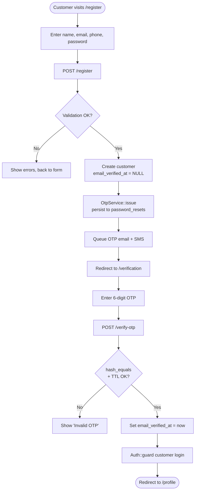
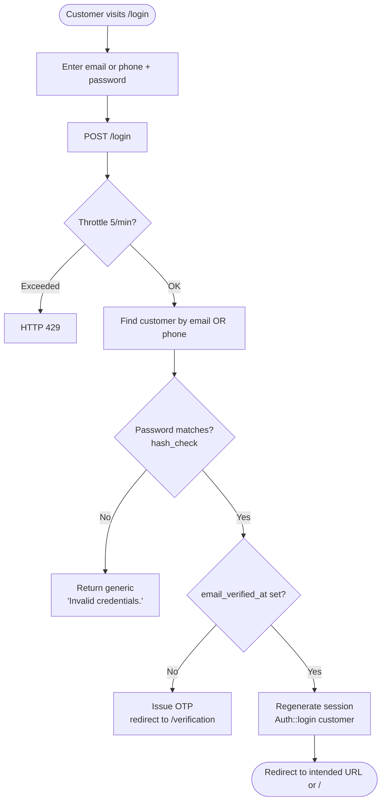
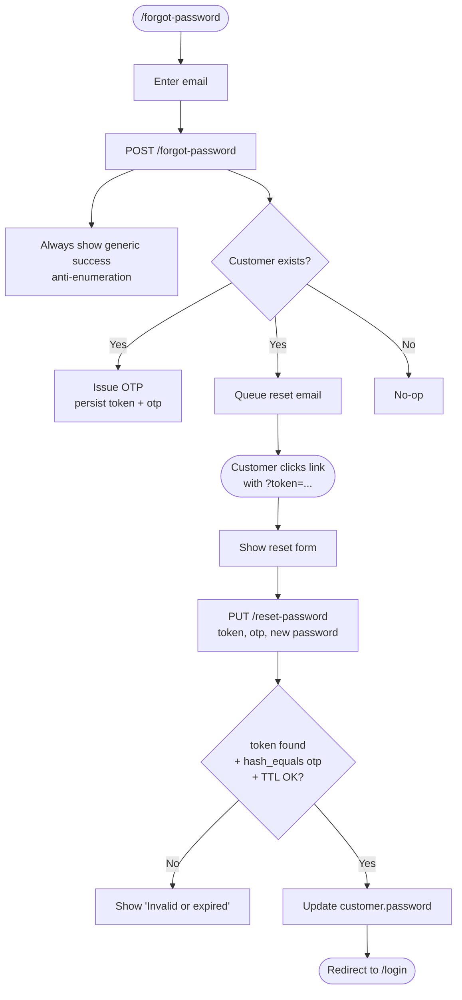
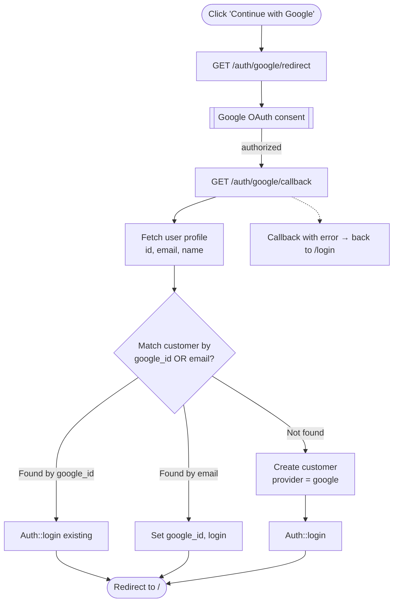
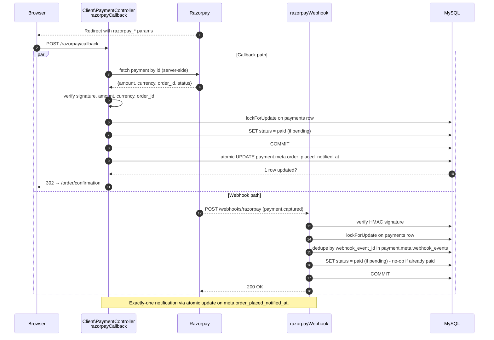
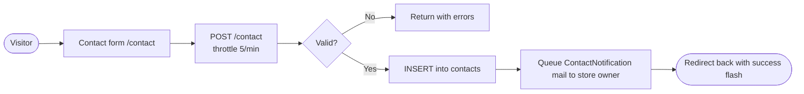
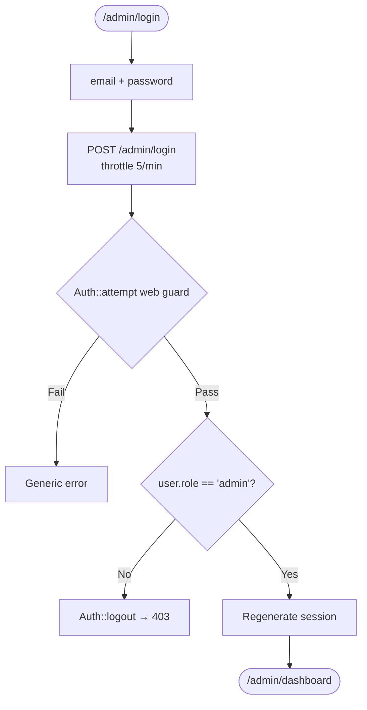

# 07 — User Flow Diagrams

Consolidated Mermaid flowcharts for every user-facing journey in Vue-Ecommerce. See [08 Admin Workflow](08-admin-workflow.md) and [09 Customer Workflow](09-customer-workflow.md) for the narrative walkthroughs.

---

## 1. Customer registration + email verification



---

## 2. Customer login (email or phone)



Key defence: password check happens **before** any OTP is issued to prevent OTP-bomb of known emails.

---

## 3. Password reset



---

## 4. Google OAuth login



⚠️ **Known gap:** The email-match branch can allow an attacker to bind their Google account to a pre-existing password account. See [15 Security](15-security-architecture.md).

---

## 5. Browse → cart → checkout → payment

```mermaid
flowchart TD
    Home([/ Home]) --> Browse[Browse shop / product-detail]
    Browse --> Variant{Has variants?}
    Variant -- Yes --> Pick[Pick attributes]
    Variant -- No --> Add
    Pick --> Add[POST /add-to-cart]
    Add --> ShowCart[Cart badge updated]
    ShowCart --> Continue{Continue shopping?}
    Continue -- Yes --> Browse
    Continue -- No --> CartPage[GET /shopping-cart]
    CartPage --> Adjust[Adjust quantities / remove]
    Adjust --> Checkout[GET /checkout]
    Checkout --> Authed{Signed in?}
    Authed -- No --> Login[Redirect to /login → back]
    Authed -- Yes --> AddressStep
    Login --> AddressStep[Select or add address]
    AddressStep --> CouponOpt{Apply coupon?}
    CouponOpt -- Yes --> ApplyCoup[POST /apply-coupon]
    CouponOpt -- No --> PickMethod
    ApplyCoup --> PickMethod[Choose gateway: COD / Razorpay]
    PickMethod --> TOS[Tick agree_tos]
    TOS --> Place[POST /order]

    Place --> Method{payment_method?}
    Method -- COD --> CODFlow[Insert order/payment status=pending, decrement stock, notify]
    CODFlow --> Confirm([→ /order/confirmation/{orderNo}])

    Method -- Razorpay --> RZP[Create Razorpay order]
    RZP --> Checkout2[Show Razorpay checkout modal]
    Checkout2 --> Result{Payment result}
    Result -- Success --> Callback[POST /razorpay/callback]
    Callback --> Verify[Verify signature + amount + currency]
    Verify -- OK --> MarkPaid[Payment status → paid<br/>lockForUpdate on payment row]
    MarkPaid --> Notify[Queue OrderPlaced notif + SMS]
    Notify --> Confirm2([→ /order/confirmation/{orderNo}])
    Result -- Failure --> Fail[Payment status → failed, redirect back]
    Verify -- Bad --> Reject[HTTP 400 / 422]

    Confirm --> DoneA([End])
    Confirm2 --> DoneB([End])
```

Full detail in [09 Customer Workflow](09-customer-workflow.md) and [10 Payment Architecture](10-payment-architecture.md).

---

## 6. Order tracking

```mermaid
flowchart TD
    Start([Customer visits /track]) --> Form[Enter order# + email]
    Form --> Verify[POST /track]
    Verify --> Match{order_no + email match?}
    Match -- No --> Err[Show generic error]
    Match -- Yes --> Grant[Grant session for this orderNo]
    Grant --> Show[GET /track/{orderNo}]
    Show --> Poll[Optional: /track/{orderNo}/live<br/>JSON updates via JS polling]
    Poll --> Show
    Show --> Logout[POST /track/{orderNo}/logout]
    Logout --> Start
```

Session grant is scoped to a single `orderNo`; it does not authorise access to any other order.

---

## 7. Returns flow

```mermaid
flowchart TD
    Start([Customer opens delivered order]) --> Init[GET /returns/{orderNo}/new]
    Init --> Window{Within return<br/>window? default 14d}
    Window -- No --> NotAllowed[Show 'window closed']
    Window -- Yes --> Form[Pick items, reason, comment, photo]
    Form --> Submit[POST /returns/{orderNo}]
    Submit --> Create[Insert into returns<br/>+ return_items<br/>status=requested]
    Create --> AdminReview{Admin reviews}

    AdminReview -- Approve --> Approved[status=approved]
    AdminReview -- Reject --> Rejected[status=rejected + reason]
    Rejected --> DoneR([End])

    Approved --> Receive[Warehouse receives goods]
    Receive --> MarkRec[Admin: markReceived<br/>status=received]
    MarkRec --> Restock[Increment products.stock<br/>AND product_variants.stock]
    Restock --> Refund[Admin: markRefunded<br/>status=refunded]
    Refund --> RefundGate{Was Razorpay?}
    RefundGate -- Yes --> RzpRefund[Admin manually invokes Order refund action<br/>Razorpay refund API]
    RefundGate -- No --> CODRefund[Refund to source manually]
    RzpRefund --> DoneG([End])
    CODRefund --> DoneG

    Start2([Customer /returns/view/{returnNo}/cancel]) --> CancelChk{status == requested?}
    CancelChk -- Yes --> Cancelled[status=cancelled]
    CancelChk -- No --> NotCancelable[Reject]
```

⚠️ `markRefunded` **does not** auto-trigger a Razorpay refund; admin must invoke `POST /admin/a_orders/{order}/refund` separately (see [26 Known Limitations G-13](26-known-limitations.md)).

---

## 8. Wishlist toggle

```mermaid
flowchart TD
    Start([Click heart on product card]) --> Auth{Customer signed in?}
    Auth -- No --> Login[Redirect to /login → back]
    Auth -- Yes --> Toggle[POST /wishlist/toggle]
    Toggle --> Exists{Row in wishlists<br/>customer_id + product_id + variant_id?}
    Exists -- Yes --> Remove[DELETE row]
    Exists -- No --> Insert[INSERT row]
    Remove --> Resp[{added:false}]
    Insert --> Resp2[{added:true}]
```

---

## 9. Admin — assign AWB & dispatch shipment

```mermaid
flowchart TD
    Start([Admin opens order detail]) --> Check[GET /admin/a_orders/{order}/serviceability<br/>call courier API]
    Check --> Available{Serviceable?}
    Available -- No --> Choose[Choose different courier or split]
    Available -- Yes --> AssignAWB[POST /admin/a_orders/shipment/{s}/assign-awb]
    AssignAWB --> CallAdapter[ShiprocketAdapter::assignAwb]
    CallAdapter --> Store[Save awb_code, courier_id, courier_name,<br/>label_url, tracking_url]
    Store --> Notify[notifyCustomerShipped guarded by meta.ship_notified_at]
    Notify --> Label[POST /admin/a_orders/shipment/{s}/label<br/>generate label PDF]
    Label --> Pickup[POST /admin/a_orders/shipment/{s}/pickup<br/>request pickup]
    Pickup --> Sync[Periodic POST /admin/a_orders/shipment/{s}/sync<br/>or wait for webhook]
    Sync --> Done([Shipment tracked])
```

---

## 10. Razorpay callback + webhook race



---

## 11. Refund (admin-initiated)

```mermaid
flowchart TD
    Start([Admin opens order detail]) --> Btn[Click Refund button]
    Btn --> Post[POST /admin/a_orders/{order}/refund<br/>amount?]
    Post --> Type{payment.type?}
    Type -- razorpay --> Rzp[RazorpayGateway::refund<br/>call Razorpay API]
    Rzp --> Cap[Cap amount at remaining refundable]
    Cap --> Persist[Update payment.refund_id, refunded_amount, refunded_at]
    Persist --> WH[Webhook confirms refund.processed<br/>dedup by refund_id]
    Persist --> Log[Log admin action]
    Type -- cod --> Manual[Manual - record refunded amount + reason]
    Log --> Done
    Manual --> Done([End])
```

---

## 12. Contact form



---

## 13. Admin login



---

## 14. Session lifecycle (both guards)

- Session lifetime = 120 minutes.
- Session driver = database (`sessions` table).
- On login: `session::regenerate()`.
- On logout: `session::invalidate()` + `session::regenerateToken()`.
- Session cookies: `HttpOnly=true`, `SameSite=lax`, `Secure=true` (in production over HTTPS).
