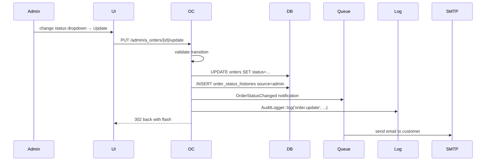

# 08 — Admin Workflow

This document walks through the day-in-the-life journeys of the store owner and ops team through the Inertia+Vue admin panel served at `/admin/*`.

---

## 1. Admin panel entry points

- URL: `/admin/login`
- Layout: `Layouts/MainLayout.vue` (sidebar + top header + content slot)
- Sidebar (`Components/Sidebar.vue`) exposes navigation items grouped as:
  - Dashboard
  - Catalog: Products, Categories
  - Sales: Orders, Payments, Returns
  - Marketing: Coupons, Sliders
  - CRM: Contacts
  - Settings: Store settings, Payment gateways, Courier partners
  - Reports (CSV exports)
- Global keyboard shortcut: **⌘K / Ctrl+K** — opens `Components/ui/CommandPalette.vue` (search for any page or entity).

---

## 2. Daily ops routine

### Morning (10 minutes)
1. Land on `/admin/dashboard`.
2. Scan KPI cards (revenue today, orders today, customers this week).
3. Check low-stock card (products at or below `LOW_STOCK_THRESHOLD`, default 5).
4. Open Orders — filter by `status=pending` → new orders since yesterday.

### Order processing (per order, ~2 min)
1. `/admin/a_orders` → click order → detail view.
2. Verify shipping address, item list, payment status.
3. Check courier serviceability (`GET /admin/a_orders/{order}/serviceability`).
4. Assign AWB (`POST /admin/a_orders/shipment/{shipment}/assign-awb`).
5. Generate label PDF (`POST /admin/a_orders/shipment/{shipment}/label` — opens the PDF).
6. Request pickup (`POST /admin/a_orders/shipment/{shipment}/pickup`).
7. Order status → `confirmed` (auto or via update).
8. Customer receives OrderShipped email + SMS (once, guarded).

### Afternoon (as needed)
- Check `/admin/returns` for new return requests → approve / reject.
- Check `/admin/a_contacts` for customer inquiries.
- Sync stuck shipments (`POST /admin/a_orders/shipment/{shipment}/sync`).

### Weekly
- Export orders / payments CSV.
- Review coupons — deactivate expired.
- Update sliders for the week's promotions.

---

## 3. Product management

```mermaid
flowchart TD
    Landing[/admin/a_products/] --> Search[Search by name/SKU/slug]
    Search --> List[Data table with actions]
    List --> Actions{Choose}
    Actions -- Create --> Create[/admin/a_products/create/]
    Actions -- Edit --> Edit[/admin/a_products/{id}/edit/]
    Actions -- Delete --> Del[Soft delete]
    Create --> Form
    Edit --> Form
    Form[Product form: name, slug, categories, brand,<br/>short/long description, price, compere_price, stock,<br/>SKU, weight, tax_class, HS code, barcode,<br/>SEO tags, images, variants]
    Form --> Variants{Has variants?}
    Variants -- Yes --> Matrix[Variant matrix: per row set<br/>SKU, price, stock, weight, options JSON]
    Variants -- No --> SimpleSave
    Matrix --> SimpleSave[POST /admin/a_products/create or PUT update]
    SimpleSave --> Redirect[Redirect to list]
```

**Notes:**
- Categories are M:N via `product_categories` — multiple selection.
- Media uploaded via Dropzone.js goes to `public/uploads/products/`; DB entry in `product_medias`.
- Variant option types (`option_types` JSON on `products`) are the source of truth for the variant matrix labels; each variant's `options` JSON dict must contain a value for each option type.
- Delete is soft (`deleted_at`) — product remains queryable via `withTrashed()`.

---

## 4. Category management

- `/admin/a_category` — flat list with pagination.
- Create/Edit — pick `parent_id` (self-FK) for subcategories.
- `featured=1` categories are surfaced on the storefront homepage (up to 4).
- Deleting a parent category orphans children (FK is `nullOnDelete` for `parent_id`).

---

## 5. Order management

### 5.1 Order list — `/admin/a_orders`
- Columns: order_no, customer, phone, total, payment status, order status, date.
- Filters: status dropdown, date range, search.
- CSV export.

### 5.2 Order detail — `/admin/a_orders/{order}/detail`
- Section 1 — Order summary (order_no, dates, statuses).
- Section 2 — Customer info (name, email, phone).
- Section 3 — Shipping address (`shipping_*` columns).
- Section 4 — Line items (with variant snapshot).
- Section 5 — Totals (sub_total, shipping, discount, total).
- Section 6 — Payment info (type, status, gateway payment_id, refunded_amount).
- Section 7 — Shipment section (provider, awb, status timeline).
- Section 8 — Action buttons:
  - Update status (`PUT /admin/a_orders/{id}/update`)
  - Add delivery info (`PUT /admin/a_orders/{order}/delivery`)
  - Check serviceability (`GET /admin/a_orders/{order}/serviceability`)
  - Assign AWB (`POST /admin/a_orders/shipment/{shipment}/assign-awb`)
  - Generate label (`GET /admin/a_orders/{order}/label` or `POST .../shipment/{shipment}/label`)
  - Request pickup (`POST .../shipment/{shipment}/pickup`)
  - Sync tracking (`POST .../shipment/{shipment}/sync`)
  - Cancel shipment (`POST .../shipment/{shipment}/cancel`)
  - Refund (`POST /admin/a_orders/{order}/refund`)
  - View invoice (`GET /admin/a_orders/{order}/invoice`)

### 5.3 Order status update


---

## 6. Return management

- `/admin/returns` — list; filter by status.
- Detail view — items, refund amount, reason, photo.
- Actions:
  - **Approve** — `POST /admin/returns/{return}/approve` → `status=approved`.
  - **Reject** — `POST /admin/returns/{return}/reject` (with reason) → `status=rejected`.
  - **Mark Received** — `POST /admin/returns/{return}/received` → `status=received`, **restocks** both product and variant stock atomically.
  - **Mark Refunded** — `POST /admin/returns/{return}/refunded` → `status=refunded` (only allowed from `received`).

**Gap** (see [26 Known Limitations G-13](26-known-limitations.md)): `markRefunded` records `refunded_at` but does not call Razorpay refund. Admin must do that separately via the order refund action.

---

## 7. Payment management

- `/admin/a_payment` — list of all payment rows.
- View / delete (rare — retained for legacy).
- No bulk refund UI.

---

## 8. Coupons

- `/admin/a_coupons` — CRUD list with columns (code, type, value, used_count, expires_at, is_active).
- Create form fields: code (unique), type (fixed/percent), value, min_order, max_discount, usage_limit, customer_id (optional single-customer scope), starts_at, expires_at.
- Toggle active with `POST /admin/a_coupons/{coupon}/toggle`.

---

## 9. Sliders

- `/admin/slider` — CRUD list.
- Each slider has multiple media (image or video) via `slider_media`.
- Media form: file, caption, action_url (destination on click), priority.

---

## 10. Contacts

- `/admin/a_contacts` — read-only list of contact form submissions.
- Delete only (no reply feature).

---

## 11. Settings

- `/admin/setting` — single-row form:
  - Name, email, phone.
  - Address, city.
  - Logo, favicon (via CommonHelper::uploadFile).
  - Social links (JSON — facebook, instagram, twitter, etc.).

---

## 12. Payment gateway configuration

- `/admin/settings/payment-gateways` — cards for each `payment_gateways` row (Razorpay, Stripe, PayPal, COD by default).
- Edit form:
  - Mode dropdown (test / live).
  - Credentials block (rendered per-gateway; e.g. Razorpay shows `key`, `secret`, `webhook_secret`). Values encrypted at rest.
  - Config block (JSON key/value editor).
  - Priority number.
- Actions: Toggle active, Set default, Test connection.
- **Audit:** every change persisted to `admin_activity_logs` with before/after JSON diff (`AuditLogger`).

---

## 13. Courier partner configuration

- `/admin/settings/couriers` — cards for each `delivery_partners` row.
- Edit form parallels payment gateway UI.
- Credentials examples:
  - Shiprocket: `email`, `password`, `pickup_location`, `pickup_pincode`, `channel_id`, `webhook_token`.
  - Delhivery: `api_token`, `client_name`, `pickup_pincode`, `pickup_location_name`.
- Actions: Toggle active, Set default, Test connection.

---

## 14. Reports

- `GET /admin/reports/orders.csv` — Streams a CSV of orders with columns (order_no, customer, total, status, payment status, created_at).
- `GET /admin/reports/payments.csv` — Streams a CSV of payments (order_no, type, amount, status, payment_id, refunded_amount).
- Query params typically include date filters.

---

## 15. Admin profile

- `/admin/profile` — Read-only view of the current admin's name, email, role.
- `PATCH /admin/profile` — Update name and email (password change is via `/admin/password`).

---

## 16. Command palette

Global palette accessible with **⌘K** / **Ctrl+K**.
- Instant search over navigation items (Dashboard, Products, Orders, …).
- Keyboard-driven: arrow keys to select, enter to navigate.
- Composable in `Composables/useCommandPalette.js`.

---

## 17. Audit trail

Every meaningful admin write (gateway update, courier toggle, return approve/reject/received/refunded, order status update, order refund) is persisted to `admin_activity_logs` with:

- `user_id` — the admin who made the change.
- `action` — namespaced string, e.g. `payment_gateway.update`, `courier.toggle`, `return.approve`, `order.refund`.
- `subject_type` + `subject_id` — polymorphic subject reference.
- `ip`, `user_agent` — captured from `request()`.
- `changes` — JSON diff `{before: {...}, after: {...}}`.

Query in Tinker:
```php
AdminActivityLog::latest()->take(20)->get(['id','user_id','action','subject_type','subject_id']);
```

There is no admin UI for the audit log as of v1 — this is a planned addition ([27 Roadmap](27-roadmap.md)).

---

## 18. What admins **cannot** do (from the UI)

- Approve reviews (must be done via DB).
- Manage brands as first-class entities.
- Manage admin users (invite, suspend, role-assign).
- View audit logs.
- Create tax rates or configure GST.
- Trigger automated notifications ad-hoc (only order-status changes fire notifications).
- Manage translations / locales.
- Configure webhook URLs from within admin (they are file-configured routes).

See [26 Known Limitations](26-known-limitations.md).
