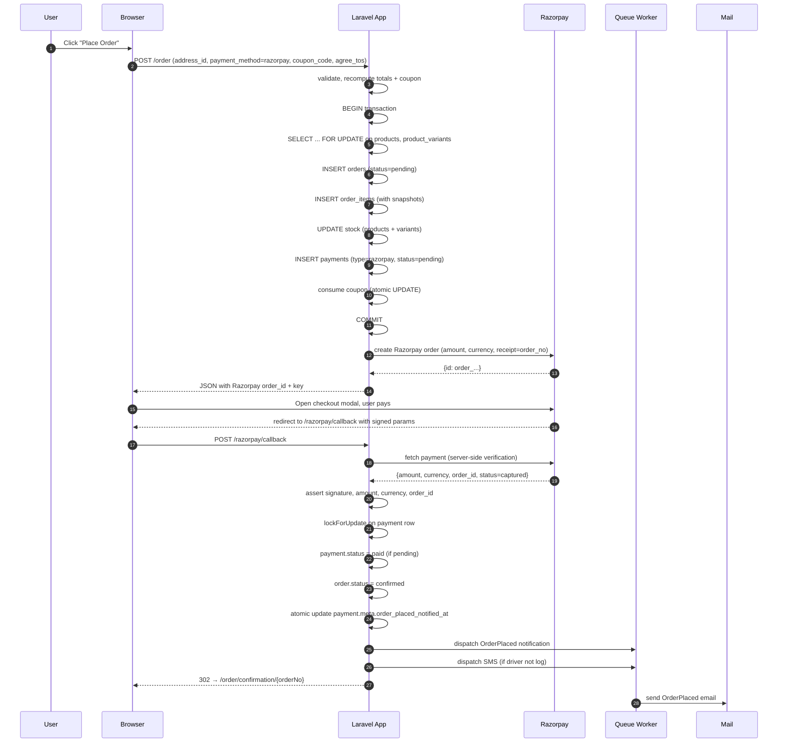

# 09 — Customer Workflow

Narrative walkthroughs of the storefront experience, from first landing to post-purchase.

---

## 1. First-time visitor journey

1. **Home** — `/` — Slider carousel + featured categories + featured products + footer newsletter placeholder.
2. **Browse** — Click a category card → `/shop?category={slug}`. Filters on the left, product grid on the right.
3. **Product** — Click a card → `/product-detail/{slug}`.
   - Image gallery with PhotoSwipe zoom.
   - Variant picker (radios per attribute — Size, Colour, …).
   - Add-to-cart (POST /add-to-cart) — session-based, no login required.
4. **Cart** — Click the cart icon → `/shopping-cart`.
   - Adjust quantities, remove items.
   - Coupon input (opens `/apply-coupon` XHR).
   - CTA: **Proceed to checkout**.

### Guest-cart persistence
- Cart is stored in the PHP session (cookie `laravel_session`).
- Sessions last 120 minutes of inactivity (`SESSION_LIFETIME`).
- Cart does **not** merge across browsers/devices — no server-side cart-for-guest.
- When a guest signs in, the current session cart is preserved.

---

## 2. Account registration

1. `/register` — Form: name, email, phone, password, terms.
2. **POST /register** — Creates a `customers` row with `email_verified_at = NULL`, dispatches OTP.
3. Redirect to `/verification`.
4. User enters 6-digit OTP → **POST /verify-otp**.
5. On success — `email_verified_at = now()`, session started, redirect to `/profile`.

Registration is **required** to place an order (guest checkout is not supported).

---

## 3. Login options

- **Email or phone + password** — `POST /login`.
- **Google** — `/auth/google/redirect` → Google OAuth → `/auth/google/callback` → session start.
- **Forgot password** — OTP-based reset flow (see [07 User Flows § 3](07-user-flows.md)).

If `email_verified_at` is still NULL, password login re-issues an OTP and redirects to `/verification` (only **after** password verification succeeds).

---

## 4. Complete purchase flow (Razorpay)

### Notes
- Server recomputes totals and the coupon at commit time; nothing the browser posts about pricing is trusted.
- Stock decrement is atomic under `lockForUpdate()` on both product and variant.
- Payment row is locked before status flip to serialise callback/webhook.
- Notification dispatch is dedup'd via `payment.meta.order_placed_notified_at`.

---

## 5. Complete purchase flow (COD)

Similar to Razorpay but:
- `payment_method=cod` triggers the COD branch.
- `payments.type = 'cod'`, `payments.status = 'pending'` (turned `paid` when courier confirms delivery + COD collection, or manually by admin).
- No Razorpay order creation.
- Straight redirect to `/order/confirmation/{orderNo}`.

⚠️ **Known limitation** (see [26 Known Limitations G-11](26-known-limitations.md)): stock is decremented on order placement, not on payment. Bad-actor COD orders can drain inventory.

---

## 6. Post-purchase actions

### 6.1 Order confirmation — `/order/confirmation/{orderNo}`
- Shows thank-you + order number.
- Full itemised order.
- Buttons: **View invoice** (`/invoice/{orderNo}`) and **Track shipment** (`/track/{orderNo}` — grant issued in-session).
- Ownership-guarded: 403 if `customer_id` mismatch.

### 6.2 Invoice — `/invoice/{orderNo}`
- Print-friendly HTML (Blade view `resources/views/invoices/show.blade.php`).
- Customer can print or use browser "Save as PDF".
- Ownership-guarded.

### 6.3 Order history — `/profile` (orders tab)
- List of past orders with status.
- Click into an order for the same detail view.

### 6.4 Tracking — `/track/{orderNo}`
- Once granted (from order confirmation or explicit verification via `/track` form), shows status timeline + carrier updates.
- Live polling via `/track/{orderNo}/live` (JSON, rate-limited 120/min).

---

## 7. Returns

1. Customer opens a delivered order in `/profile`.
2. Clicks **Request return** → `/returns/{orderNo}/new`.
3. Fills in items to return (quantity per item), reason (dropdown), comment, optional photo.
4. **POST /returns/{orderNo}** — Creates `returns` row + `return_items`, status `requested`.
5. Redirect to `/returns/view/{returnNo}` — status page.
6. Optionally cancel — **POST /returns/view/{returnNo}/cancel** — only allowed while `status = requested`.
7. Wait for admin to review (approve / reject) — see [08 Admin Workflow § 6](08-admin-workflow.md).
8. Once refunded, customer sees `status = refunded` and refund amount.

Return window is `RETURNS_WINDOW_DAYS` (default 14) from delivery.

---

## 8. Wishlist

- Every product card and product detail page has a heart button.
- Toggling on/off is a single POST to `/wishlist/toggle` (JSON response).
- Un-authenticated users get bounced to `/login`.
- `/wishlist` page — grid of saved products with quick-add-to-cart and remove.

---

## 9. Reviews

- Product-detail page shows approved reviews.
- Signed-in customers see a **Write a review** form:
  - 1–5 star rating.
  - Title, review body, optional image (max 2 MB).
  - Submits to `POST /reviews`.
- New reviews land as `is_approved = false`; admin must approve (currently DB-only — see [26 Known Limitations G-4](26-known-limitations.md)).

---

## 10. Profile management

- `/profile` tabs:
  - **Profile** — name, email, phone; update via `PUT /profile`.
  - **Avatar** — image upload via `PUT /profile-image`.
  - **Password** — current + new + confirm; `PUT /update-password`.
  - **Addresses** — CRUD via `/user-address-*` routes.
  - **Orders** — list + detail.
  - **Wishlist** — same as `/wishlist`.

---

## 11. Contact form

- `/contact` — public form.
- Rate-limited to 5 submissions per IP per minute.
- Admin gets a queued email notification.

---

## 12. Customer-visible errors & edge cases

| Situation                                | Behaviour                                                             |
| ---------------------------------------- | --------------------------------------------------------------------- |
| Cart product goes out of stock during checkout | Order rejected at commit with a stock error; user is asked to adjust |
| Coupon expires between apply and place-order  | Discount silently drops on recompute; totals shown to user before commit |
| Payment fails                            | Payment status flipped to `failed`; stock NOT restored automatically (see [26 Known Limitations](26-known-limitations.md)); order remains in `pending`; user can retry |
| Session expires mid-checkout             | User bounced to `/login` with intended URL preserved                  |
| Duplicate submit of `/order`             | Session-based 5-second lock prevents duplicate; DB unique index on `order_no` catches slippage |
| Duplicate submit of `/apply-coupon`      | Idempotent — same discount recomputed                                 |
| Duplicate submit of `/wishlist/toggle`   | Idempotent — toggles or no-ops                                        |

---

## 13. Mobile experience

- Layout is responsive (Bootstrap 5 grid).
- Header collapses to a hamburger menu.
- Cart drawer on the right.
- No native app; PWA install prompt is **not** implemented.

---

## 14. What customers **cannot** do

- Guest checkout.
- Save cart across devices without an account.
- Choose a courier at checkout (admin decides).
- Trigger their own refund.
- Add or remove reviews after posting.
- Delete their account from the UI.
- Manage payment methods (no saved cards; every payment goes through the gateway modal).
- Chat with support (no chat widget).
- Get real-time inventory reservations (stock check is only at add-to-cart and commit).
