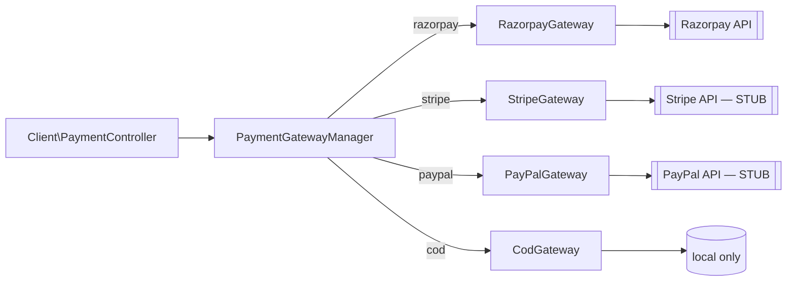
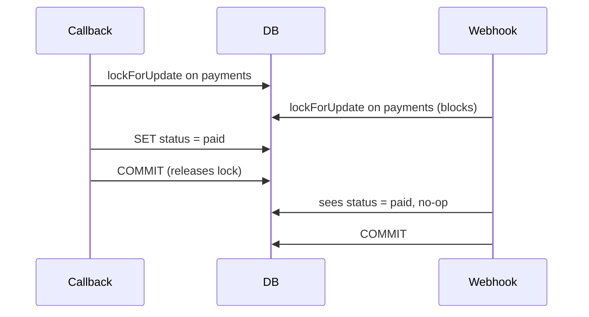

# 10 — Payment Gateway Architecture

## 1. Design

Payments follow a **strategy pattern** with a `PaymentGatewayManager` factory that returns a concrete `AbstractPaymentGateway` implementation based on the gateway code (`razorpay`, `stripe`, `paypal`, `cod`).



- **File locations:** `app/Services/Payment/*`.
- **Registration:** `PaymentGatewayManager::$drivers = [...]` returns the class name per code.
- **Config source:** the `payment_gateways` DB row (credentials, mode, config, supports). Never `config/services.php` directly for merchant-configurable fields.
- **Encryption at rest:** `payment_gateways.credentials` is a Laravel-encrypted JSON blob (rotate `APP_KEY` = data loss).

## 2. Abstract contract

```php
abstract class AbstractPaymentGateway {
    public function __construct(protected PaymentGateway $config) {}

    abstract public function createOrder(Order $order): array;
    abstract public function verifyCallback(Request $request): bool;
    abstract public function handleWebhook(array $payload, array $headers): void;
    abstract public function refund(Payment $payment, float $amount): array;
    abstract public function testConnection(): bool;
}
```

Every subclass must implement all five methods; missing implementations should throw a clear `NotImplemented` exception rather than silently returning.

## 3. Razorpay integration (production-ready)

### 3.1 Configuration
Editable via `/admin/settings/payment-gateways/razorpay/edit`. Encrypted JSON `credentials`:
```json
{
  "key": "rzp_test_XXXX",
  "secret": "*****",
  "webhook_secret": "*****"
}
```

### 3.2 Order creation
- Called from `Client\OrderController::save()` when `payment_method=razorpay`.
- Creates a Razorpay order with `amount = order.total * 100` (paisa), `currency = INR`, `receipt = order.order_no`.
- Response `id` is stored in `payment.payment_id`.

### 3.3 Callback flow — `POST /razorpay/callback`

Located in `Client\PaymentController::razorpayCallback` (rate-limited 20/min, customer-auth required).

Steps:
1. Validate signature (`razorpay_payment_id + '|' + razorpay_order_id` HMAC-SHA256 with `secret`, compared with `razorpay_signature`).
2. **Fetch the payment from Razorpay API** — do not trust the client-provided `razorpay_payment_id`.
3. Assert `payment.amount == order.total * 100`, `payment.currency == config('currency', 'INR')`, `payment.order_id == payment.payment_id` (the one we stored).
4. Take `lockForUpdate()` on the `payments` row before flipping status.
5. If `payment.status == 'pending'` set to `paid`; else no-op.
6. Atomic `UPDATE payment SET meta = JSON_SET(meta, '$.order_placed_notified_at', NOW()) WHERE meta->'$.order_placed_notified_at' IS NULL`.
7. On success (1 row affected), dispatch `OrderPlaced` notification.

Amount/currency/order-ID tampering is rejected server-side.

### 3.4 Webhook flow — `POST /webhooks/razorpay`

CSRF-exempt (in `bootstrap/app.php`), rate-limited 120/min.

Events handled:
- `payment.authorized` — status → `authorized`.
- `payment.captured` — status → `paid` (guarded — never regresses `paid`).
- `payment.failed` — status → `failed` (guarded — never regresses `paid`).
- `refund.created` — record refund_id, add to `payment.meta.processed_refund_ids` (dedup key).
- `refund.processed` — increment `payment.refunded_amount`, cap at `payment.amount`.

Signature verification (`X-Razorpay-Signature` header, HMAC-SHA256 of raw body with `webhook_secret`) is mandatory. Malformed JSON → HTTP 400 (previously returned 200 — fixed).

Dedup keys:
- Top-level event ID → `payment.meta.webhook_events[]`.
- Refund ID → `payment.meta.processed_refund_ids[]`.

### 3.5 Refund flow — `POST /admin/a_orders/{order}/refund`

- Admin picks amount (defaults to full remaining refundable).
- `RazorpayGateway::refund(payment, amount)` calls `POST /payments/{id}/refund` on Razorpay.
- On success — store refund_id, add to `processed_refund_ids`, log admin activity.
- Actual money movement is confirmed by `refund.processed` webhook.

Over-refund is capped at the original payment amount (excess is logged, not accepted). This prevents "silently absorbed" refunds if the admin submits an amount too large.

### 3.6 Race protection



## 4. COD (production-ready)

- Selected via `payment_method=cod` at checkout.
- Order and payment are created with `payments.type='cod', status='pending'`.
- Stock is decremented at order placement (⚠️ see [26 Known Limitations G-11](26-known-limitations.md) for COD-drain risk).
- Payment flips to `paid` when courier confirms delivery + collection. In v1, this is done manually by the admin from the order detail page (there is no auto-collection hook).

## 5. Stripe (STUB)

- Class present: `app/Services/Payment/StripeGateway.php`.
- Not registered as an active provider in seed data (`is_active=false`).
- All contract methods throw `NotImplemented` or return placeholder values.
- To activate: implement `createOrder` (PaymentIntent), `verifyCallback` (webhook signing key), `handleWebhook` (payment_intent.* + charge.refunded), `refund`, `testConnection`.

## 6. PayPal (STUB)

- Class present: `app/Services/Payment/PayPalGateway.php`.
- Same stub state as Stripe.
- To activate: implement PayPal Orders v2 API create/capture, webhook verification (SHA-256), refund via `/v2/payments/captures/{id}/refund`.

## 7. Adding a new gateway (checklist)

1. Create `app/Services/Payment/NewGateway.php` extending `AbstractPaymentGateway`.
2. Register in `PaymentGatewayManager::$drivers = ['new' => NewGateway::class]`.
3. Seed row in `payment_gateways`:
   ```php
   PaymentGateway::create([
     'code' => 'new',
     'name' => 'NewPay',
     'is_active' => false,
     'mode' => 'test',
     'supports' => ['refund','webhook'],
     'credentials' => encrypt(json_encode([...])),
   ]);
   ```
4. Add a Vue edit form in `resources/js/Pages/Admin/Settings/PaymentGateways/` with the gateway-specific credential fields.
5. Optionally add a checkout radio in `resources/views/client/checkout.blade.php` — the loop already iterates active gateways, so no code change is usually needed.
6. If webhooks needed — add route to `routes/web.php` under `/webhooks/new` (CSRF-exempt in `bootstrap/app.php`), controller action, throttle:120,1.
7. Test end-to-end in sandbox — cover happy path, callback tamper, duplicate webhook, over-refund.

## 8. Multi-currency

Not implemented. Amounts assume INR (single currency). If required:
- Add `orders.currency` + `payments.currency`.
- Rewrite the price display and totals math.
- Configure per-gateway supported currencies.

## 9. PCI scope

- No card data ever touches this app — Razorpay hosts its own checkout modal; only tokens/IDs come back.
- COD carries no card data.
- Storing card data is explicitly out of scope; do not add fields for it.

## 10. Failure modes to test (manual QA checklist)

| Test                                              | Expected                                                                   |
| ------------------------------------------------- | -------------------------------------------------------------------------- |
| Razorpay callback with tampered amount            | 422; payment stays `pending`; no notification                              |
| Razorpay callback with mismatched signature       | 400; no state change                                                       |
| Duplicate Razorpay `payment.captured` webhook     | 200; payment stays `paid`; no second notification                          |
| Refund > payment.amount                           | Cap applied; log written; user sees warning                                |
| `payment.failed` webhook after `paid`             | 200; status stays `paid`                                                   |
| Concurrent callback + webhook                     | Payment ends `paid`; notification sent exactly once                        |
| Cart out-of-stock during checkout                 | Order rejected; stock unchanged                                            |
| COD order + Razorpay order for same cart submitted twice | Second submit rejected (session lock)                                |
| APP_KEY changed                                   | Existing credentials become unreadable — expected                          |

Automated tests are **not** written for these; verify manually until [20 Testing Strategy](20-testing-strategy.md) is executed.
