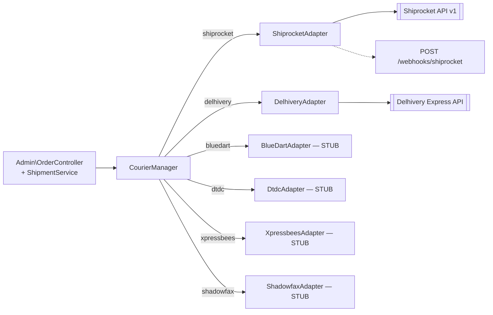
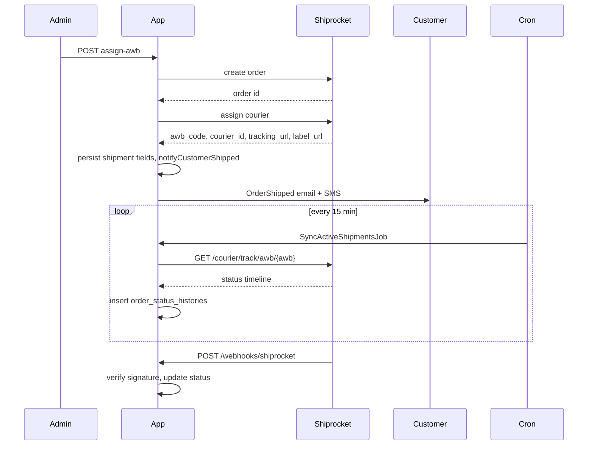

# 11 — Courier Partner Architecture

## 1. Design

Couriers use the same **strategy pattern** as payments: a `CourierManager` factory returns a concrete `AbstractCourierAdapter` based on the partner code (`shiprocket`, `delhivery`, `bluedart`, `dtdc`, `xpressbees`, `shadowfax`).



- **File locations:** `app/Services/Courier/*`.
- **Registration:** `CourierManager::$drivers`.
- **Config source:** `delivery_partners` DB row (credentials, mode, config, supports). Encrypted at rest with `APP_KEY`.

## 2. Abstract contract

```php
abstract class AbstractCourierAdapter {
    public function __construct(protected DeliveryPartner $partner) {}

    abstract public function checkServiceability(string $pincode, float $weight): array;
    abstract public function assignAwb(Shipment $shipment): array;
    abstract public function generateLabel(Shipment $shipment): string; // URL or path to PDF
    abstract public function requestPickup(Shipment $shipment): array;
    abstract public function syncTracking(Shipment $shipment): array;
    abstract public function cancelShipment(Shipment $shipment): array;
    abstract public function testConnection(): bool;
}
```

Every subclass must implement all methods; stubs throw `NotImplemented`.

## 3. Shiprocket (production-ready)

### 3.1 Configuration
Editable at `/admin/settings/couriers/shiprocket/edit`. Encrypted JSON `credentials`:
```json
{
  "email": "ops@yourbrand.com",
  "password": "*****",
  "pickup_location": "Primary",
  "pickup_pincode": "560001",
  "channel_id": "1234",
  "webhook_token": "*****"
}
```
`config` (non-sensitive JSON):
```json
{ "default_length": 10, "default_breadth": 10, "default_height": 5, "default_weight": 0.5 }
```

Auth pattern: `POST /v1/auth/login` returns a JWT; cached with a TTL, refreshed on 401.

### 3.2 Serviceability check — `GET /admin/a_orders/{order}/serviceability`
- Calls Shiprocket `GET /v1/courier/serviceability` with pickup/delivery pincodes, weight.
- Returns list of couriers with rates, ETA, and COD support.

### 3.3 Assign AWB — `POST /admin/a_orders/shipment/{s}/assign-awb`
- Creates Shiprocket order if not already (`POST /v1/orders/create/adhoc`).
- Then `POST /v1/courier/assign/awb` with chosen `courier_id`.
- On success — stores `awb_code`, `courier_id`, `courier_name`, `label_url`, `tracking_url` on the `shipments` row.
- **Fires `notifyCustomerShipped()`** — sends OrderShipped mail + SMS, guarded by `shipment.meta.ship_notified_at`.

### 3.4 Generate label — `POST /admin/a_orders/shipment/{s}/label`
- Calls `POST /v1/courier/generate/label` for a PDF URL.
- URL stored in `shipment.label_url`.

### 3.5 Request pickup — `POST /admin/a_orders/shipment/{s}/pickup`
- Calls `POST /v1/courier/generate/pickup`.
- Stores `pickup_scheduled_date`.

### 3.6 Sync tracking — `POST /admin/a_orders/shipment/{s}/sync`
- Calls `GET /v1/courier/track/awb/{awb}`.
- Parses status timeline; inserts new entries into `order_status_histories` with `source=webhook` when driven by the cron.
- Updates `shipment.status`, `shipment.shipped_at`, `shipment.delivered_at`.

### 3.7 Cancel shipment — `POST /admin/a_orders/shipment/{s}/cancel`
- Calls `POST /v1/orders/cancel` with shipment ID.
- Updates `shipment.status = 'cancelled'`.

### 3.8 Webhook — `POST /webhooks/shiprocket`
- Signature verification: HMAC-SHA256 of raw body with `services.shiprocket.webhook_secret`, compared with `X-Shiprocket-Signature` header.
- Fallback (BC): header-only shared token (`X-Auth-Token`) matched against `webhook_token`. Query-string tokens are **rejected** (they would leak to access logs).
- Malformed JSON → HTTP 400 (was 200 before hardening).
- Payload updates shipment status + inserts `order_status_histories` row.

## 4. Delhivery (adapter present, less-tested)

- File: `app/Services/Courier/DelhiveryAdapter.php`.
- Uses API token (`credentials.api_token`) as `Authorization: Token <token>`.
- Endpoints roughly map to serviceability, waybill creation, label download, pickup request, tracking, cancel.
- No webhook (Delhivery is typically pull-based); the scheduled `SyncActiveShipmentsJob` handles updates.

## 5. Other couriers (STUB)

- `BlueDartAdapter`, `DtdcAdapter`, `XpressbeesAdapter`, `ShadowfaxAdapter` — file-level scaffolds only.
- All methods throw `NotImplemented`.
- Test them before enabling in production.

## 6. Fallback tracking sync (cron)

`routes/console.php`:
```php
Schedule::job(new SyncActiveShipmentsJob())
    ->everyFifteenMinutes()
    ->withoutOverlapping(15);
```

`SyncActiveShipmentsJob`:
- Fetches shipments where `status NOT IN ('delivered', 'cancelled', 'rto_delivered')` and `updated_at > now - 30 min` (configurable).
- Groups by provider, throttles per-provider API calls.
- Batch cap: 100 shipments per run.
- Timeout: 4 minutes.
- Failures logged to `failed_jobs`.

Primary channel is webhooks (Shiprocket). This is the safety net.

## 7. Adding a new courier (checklist)

1. Create `app/Services/Courier/NewCourierAdapter.php` extending `AbstractCourierAdapter`.
2. Register in `CourierManager::$drivers`.
3. Seed row in `delivery_partners`.
4. Add a Vue edit form in `resources/js/Pages/Admin/Settings/Couriers/` for its credential fields.
5. If webhook — add route `POST /webhooks/newcourier` (CSRF-exempt), throttle:120,1, controller with signature verification.
6. Test with a sandbox account: serviceability → assign AWB → label → pickup → tracking sync → cancel.

## 8. Data flow — happy shipment



## 9. Failure modes to test

| Test                                       | Expected                                                        |
| ------------------------------------------ | --------------------------------------------------------------- |
| Assign AWB with bad pincode                | Serviceability check returns empty → admin sees clear error     |
| Webhook with bad signature                 | 400; state unchanged                                            |
| Duplicate webhook for same status          | 200 (dedupe on latest status)                                   |
| Sync job hits provider rate limit          | Backoff + retry via queue                                       |
| Cancel already-picked shipment             | Provider rejects; admin sees error                              |
| notifyCustomerShipped called twice         | Second call no-ops (guarded by `meta.ship_notified_at`)         |

## 10. Multi-shipment orders

The schema allows N shipments per order (`shipments.order_id`) but the UI and services assume 1:1. Split-shipment support would need:

- UI to select items per shipment.
- `ShipmentService::split(order, items[])`.
- Adjust invoice + tracking + refund logic.

Not implemented in v1.
