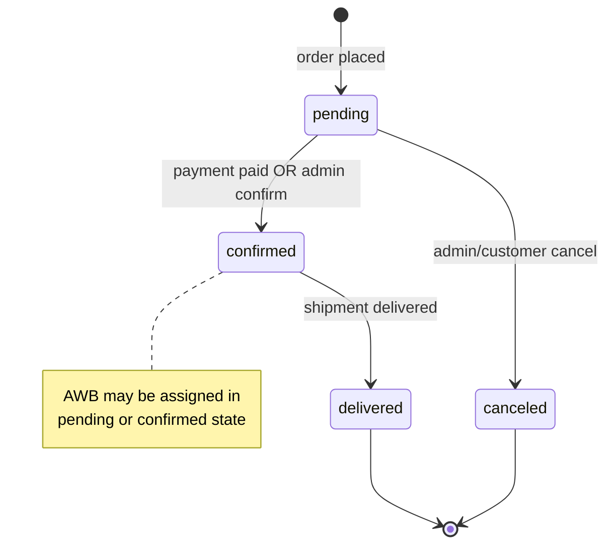
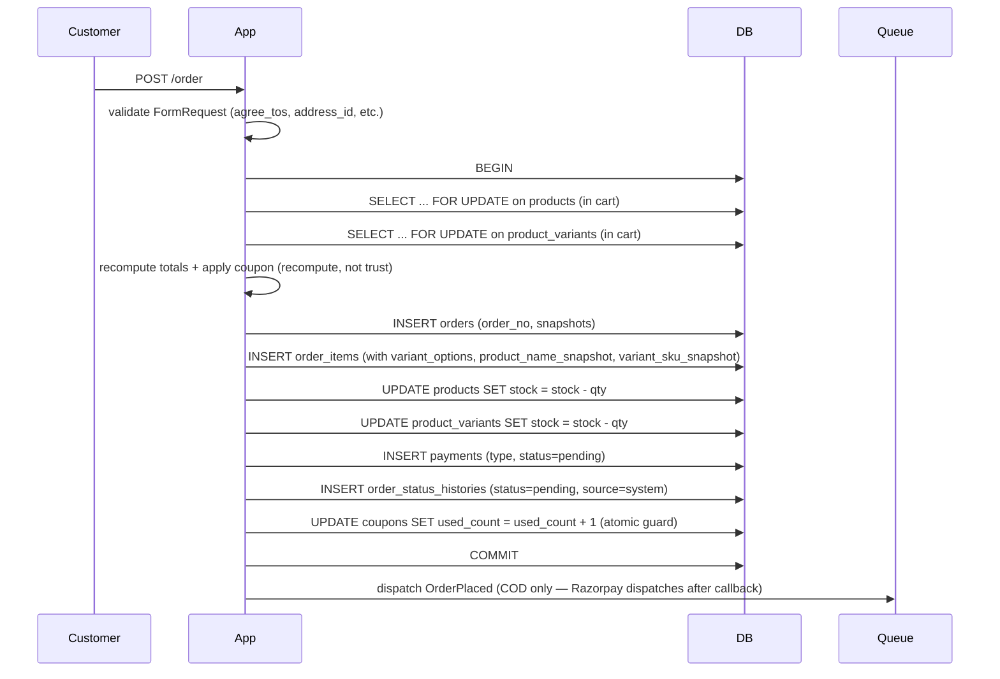

# 12 — Order Management Flow

## 1. Order lifecycle



- Enum values on `orders.status`: `pending | confirmed | delivered | canceled`.
- Every transition is written to `order_status_histories` with `source ∈ {system, admin, webhook, customer}`.

## 2. Order-number generation

- Format: `ORD-XXXXXX` (padded numeric suffix).
- Generation: `latest('id')->first()->id + 1` inside a transaction (`Client\OrderController::save`).
- ⚠️ **Race:** Two simultaneous placements can compute the same next number; MySQL's unique index on `order_no` protects the DB (throws duplicate-key) but exposes a user-visible 500 under contention. Recommended fix in [26 Known Limitations](26-known-limitations.md).

## 3. Order placement (transactional)



Key invariants:
- All writes are inside a single transaction; either everything commits or nothing does.
- Stock cannot go negative because the FOR-UPDATE row lock plus a stock re-check would return an error before COMMIT.
- Coupon `used_count` update includes a `WHERE (usage_limit IS NULL OR used_count < usage_limit)` guard so a race between two customers using the last redemption is atomic.

## 4. Line-item snapshots

`order_items` captures data that mustn't change after purchase:

- `product_name_snapshot` — product name at purchase time.
- `variant_sku_snapshot` — variant SKU at purchase time.
- `variant_options` — JSON `{Size: "M", Color: "Red"}`.
- `price` — unit price at purchase.
- `customization` — free-form JSON for personalisation.

This ensures returns and invoices display accurate historical info even if the product is later renamed or the variant is deleted.

## 5. Payment linkage

- One `payments` row per order (usually 1:1; retries insert new rows in edge cases).
- `payments.type` matches `payment_gateways.code` (`cod`, `razorpay`, `stripe`, `paypal`).
- `payments.status`: `pending → paid | failed`.
- `payments.meta` JSON stores gateway-specific IDs, webhook dedup arrays, and notification guards.

## 6. Shipment linkage

- Typically 1:1; the schema allows N.
- `shipments.status` is a free-form string driven by courier updates.
- Sample values seen in production: `pending`, `awb_assigned`, `pickup_scheduled`, `picked_up`, `in_transit`, `out_for_delivery`, `delivered`, `undelivered`, `rto_initiated`, `rto_delivered`, `cancelled`.
- `shipments.meta.ship_notified_at` guards the OrderShipped notification.

## 7. Order-status update by admin

```
PUT /admin/a_orders/{id}/update
Body: { status: 'confirmed' | 'delivered' | 'canceled' }
```

- Transitions are minimally validated (no strict FSM) — admin has latitude.
- On write:
  1. `orders.status` updated.
  2. `order_status_histories` row inserted (source=admin).
  3. `OrderStatusChanged` notification dispatched (email, queued).
  4. `admin_activity_logs` row written.

## 8. Refund

- **Initiator:** admin, from order detail page (`POST /admin/a_orders/{order}/refund`).
- **Route:**
  - If `payments.type='razorpay'` → `RazorpayGateway::refund()`; result confirmed via `refund.processed` webhook (dedup by refund_id).
  - If `payments.type='cod'` → recorded only; money movement is manual (outside app scope).
- **Cap:** amount ≤ `payment.amount - payment.refunded_amount`; over-cap is logged and truncated.
- **Stock:** refund does **not** automatically re-stock. Re-stocking happens through the return flow (`Admin\ReturnController::markReceived`), not through direct refund.

## 9. Cancellation

- Admin sets `orders.status='canceled'` via update endpoint.
- Shipment (if any) should be cancelled first (`POST /admin/a_orders/shipment/{s}/cancel`).
- **Stock:** cancellation does **not** currently restore stock (⚠️ future improvement).
- Payment, if `paid`, must be manually refunded.

## 10. Order detail view (admin)

Sections and their data sources:

| Section        | Source                                                    |
| -------------- | --------------------------------------------------------- |
| Summary        | `orders.*`                                                |
| Customer       | `orders.customer_id → customers`                          |
| Shipping addr  | `orders.shipping_*` (denormalised at placement)           |
| Line items     | `order_items` (with snapshots)                            |
| Totals         | `orders.{sub_total, shipping, discount, total}`           |
| Payment        | `payments` (1:1 usually), `payment_gateways` (for display)|
| Shipment       | `shipments` (1:1 usually), `delivery_partners`            |
| Status history | `order_status_histories`                                  |
| Actions        | Buttons wired to admin routes                             |

## 11. Invoice generation

- Route: `GET /invoice/{orderNo}` (customer) or `GET /admin/a_orders/{order}/invoice` (admin).
- Blade view: `resources/views/invoices/show.blade.php`.
- Print-friendly HTML (server-rendered); use browser "Save as PDF" for a PDF.
- Ownership-guarded for the customer path (returns 403 if `customer_id` mismatch).
- Includes: seller (from `settings`), buyer (from `orders.shipping_*`), items, totals, payment info, order_no, date.

## 12. Reports

- `GET /admin/reports/orders.csv` — streams a CSV of orders with columns (order_no, customer, phone, sub_total, shipping, discount, total, status, payment_status, created_at).
- `GET /admin/reports/payments.csv` — streams a CSV of payments (order_no, type, amount, status, payment_id, refunded_amount, created_at).
- Optional date filters via query string.
- No JSON/Excel export in v1.

## 13. Idempotency guarantees

- **Order placement** — 5-second session-based dedup + DB unique index on `orders.order_no` (belt-and-braces).
- **Payment callback / webhook** — `lockForUpdate` + status-only-flips-once semantics + webhook event ID dedup.
- **OrderPlaced notification** — atomic `UPDATE payment.meta.order_placed_notified_at` returns row-count 1 exactly once.
- **OrderShipped notification** — `shipment.meta.ship_notified_at` guard.

## 14. Concurrency scenarios (verified)

| Scenario                                        | Guarantee                                             |
| ----------------------------------------------- | ----------------------------------------------------- |
| Two customers buy last unit of a variant        | Only one succeeds; the other sees stock error         |
| Two customers use last redemption of a coupon   | Only one succeeds; the other sees "coupon exhausted"  |
| Razorpay callback & webhook race                | Payment ends `paid`; notification sent once           |
| Duplicate refund webhook                        | Refund recorded once (dedup by refund_id)             |
| Duplicate shipment webhook                      | Latest status wins; no double notification            |

## 15. What order management does **not** do

- Split shipments per order.
- Multiple payments per order (partial payment / deposit).
- Multi-currency.
- Automatic order confirmation email to admin (only customer is notified). See [26 Known Limitations](26-known-limitations.md).
- Auto-restock on cancellation.
- Automatic refund on return-marked-refunded (admin must invoke refund separately).
- SLA tracking on unshipped orders.
- Auto-cancel orders that remain `pending` beyond a timeout.
