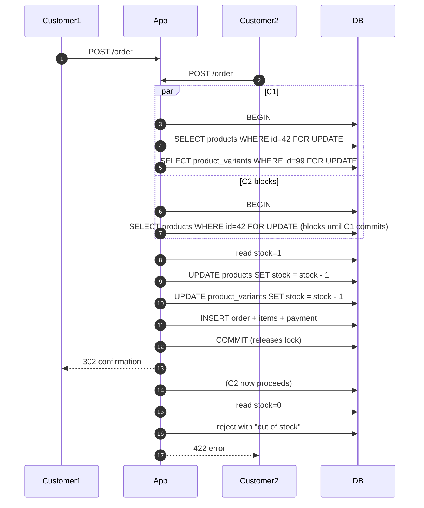

# 13 — Inventory Management

## 1. Model

Stock is tracked at two levels:

- **`products.stock`** — Aggregate stock for non-variant products or as a mirror for variant products.
- **`product_variants.stock`** — Per-variant stock (canonical when `products.has_variants=true`).

At order placement, both counters are decremented atomically for variant products, keeping them in sync.

## 2. Read paths

- Product detail — shows `stock` for the currently selected variant (or `products.stock` if no variants).
- Add-to-cart — checks stock but does **not** reserve; race is settled at order placement.
- Cart page — shows current stock; recomputed on each visit.
- Shop grid — shows badges: `Only N left` if `stock <= LOW_STOCK_THRESHOLD` (visual only, driven by JS on the page).
- Admin dashboard — Low-stock card shows all products / variants at or below the threshold, colour-coded:
  - **Red** — out of stock (`stock == 0`).
  - **Orange** — critical (`stock <= 2`).
  - **Amber** — low (`stock <= LOW_STOCK_THRESHOLD`, default 5).

Config key: `services.inventory.low_stock_threshold` (from `LOW_STOCK_THRESHOLD` env var).

## 3. Write paths (stock deltas)

| Trigger                                    | Effect                                                                             |
| ------------------------------------------ | ---------------------------------------------------------------------------------- |
| Order placement (COD or Razorpay success)  | `stock -= qty` on both product and variant, atomic under `lockForUpdate()`         |
| Return marked received (`Admin\ReturnController::markReceived`) | `stock += qty` on both product and variant                     |
| Product update by admin                    | `stock` set to whatever admin enters (no history preserved)                        |
| Variant update by admin                    | `stock` set to whatever admin enters                                               |

⚠️ **Not implemented:**
- Cancellation does **not** restore stock.
- Payment failure after order placement does **not** restore stock (order stays `pending`; admin must cancel + manually adjust).
- Reservation-only (soft-hold) semantics for COD orders — see [26 Known Limitations G-11](26-known-limitations.md).

## 4. Race protection

## 5. Low-stock threshold configuration

- Env: `LOW_STOCK_THRESHOLD=5` (defaults to 5).
- Config: `config/services.php` → `inventory.low_stock_threshold`.
- Consumers:
  - Admin dashboard warning card.
  - (Future) Automated alert email when a variant drops at/below threshold — **not implemented**.

## 6. Bulk stock updates

- Not implemented from UI.
- Ops teams edit stock per-product or per-variant via the admin form.
- For bulk updates, use MySQL directly or write a one-shot Artisan command.

## 7. Restock via returns

`Admin\ReturnController::markReceived`:

1. Loads the `returns` row and its `return_items`.
2. Only allowed from `status = 'approved'` (strict transition — throws if wrong state).
3. For each `return_item`:
   - `Product::find($orderItem->product_id)->increment('stock', $qty)`.
   - If `orderItem->product_variant_id` is set → `ProductVariant::find(...)->increment('stock', $qty)`.
4. Marks `returns.status = 'received'`, sets `received_at`.
5. Optionally logs `admin_activity_logs`.

## 8. Inventory report

- No dedicated inventory report page in v1.
- Product export CSV includes `stock`, `sku`, `price`, category, brand — usable as an inventory snapshot.

## 9. Variant option types

- `products.option_types` (JSON) — array of `{name, type}` describing the axes (e.g. `[{name:"Size",type:"text"}, {name:"Color",type:"swatch"}]`).
- `product_variants.options` (JSON) — dict with one entry per option type — `{Size:"M", Color:"Red"}`.

Constraints:
- Two variants of the same product cannot share the same `options` combination (enforced at write time in `Admin\ProductController` — not by DB constraint).
- `is_default` variant is preferred at first render on the product page.

## 10. SKU strategy

- `products.sku` is optional (nullable, indexed).
- `product_variants.sku` is optional (nullable, indexed).
- Both should be unique in practice but are **not** DB-unique.
- Barcode column also present (`products.barcode`, `product_variants.barcode`).

## 11. What inventory management does **not** do

- Multi-warehouse stock allocation.
- Batch / lot / expiry tracking.
- Serial-number tracking.
- Automated PO / reorder from vendor.
- Real-time reservations at add-to-cart.
- Stock forecast / velocity metrics.
- Auto-restock notification (email admin when out).
- Barcode scanner integration.
- Bin / location tracking.
- Stock aging.
