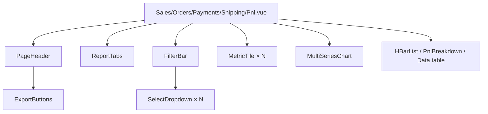

# 29 — Reports Module

Production-ready analytics module for the admin panel. Ships **five reports** — Sales, Orders, Payments, Shipping, and Profit & Loss — with KPI cards, interactive charts, filterable / sortable / paginated tables, exports (CSV / Excel / PDF / Print), and a supporting **Operating Expenses** CRUD used by P&L.

**Status:** Live as of 2026-07-17.

---

## 1. What was reused vs newly built

**Reused** — the pre-existing `Admin\ReportController` CSV streaming pattern, `KpiCard.vue`, `RevenueChart.vue`, `StatusDonut.vue`, `Sparkline.vue`, `DataTable.vue`, `Pagination.vue`, existing admin layout and Tailwind theme tokens. **No new npm or composer dependencies added.**

**Newly built:**
- 3 backend classes — `ReportFilters`, `ReportService`, `ReportExporter`
- 1 model — `Expense`
- 2 controllers — `ReportController` (rewritten) + `ExpenseController`
- 3 migrations — reports support columns, expenses table, safety-net idempotent columns
- 1 Blade view — `admin.reports.print`
- 8 Vue components under `resources/js/Components/reports/`
- 8 Vue pages under `resources/js/Pages/Admin/Reports/` and `resources/js/Pages/Admin/Expenses/`
- 1 sidebar group + 7 icons

---

## 2. Routes

All under `/admin/*` with `auth + admin` middleware.

| Method | URI                                        | Route name                          | Handler                                     |
| ------ | ------------------------------------------ | ----------------------------------- | ------------------------------------------- |
| GET    | `/admin/reports`                           | `admin.reports.index`               | Redirects to `sales`                        |
| GET    | `/admin/reports/sales`                     | `admin.reports.sales`               | `ReportController@sales`                    |
| GET    | `/admin/reports/orders`                    | `admin.reports.orders`              | `ReportController@orders`                   |
| GET    | `/admin/reports/payments`                  | `admin.reports.payments`            | `ReportController@payments`                 |
| GET    | `/admin/reports/shipping`                  | `admin.reports.shipping`            | `ReportController@shipping`                 |
| GET    | `/admin/reports/pnl`                       | `admin.reports.pnl`                 | `ReportController@pnl`                      |
| GET    | `/admin/reports/{report}/export?format=..` | `admin.reports.{report}.export`     | `ReportController@export{Report}`           |
| GET    | `/admin/reports/orders.csv`                | `admin.reports.orders.csv`          | Legacy alias — `ordersCsvLegacy`            |
| GET    | `/admin/reports/payments.csv`              | `admin.reports.payments.csv`        | Legacy alias — `paymentsCsvLegacy`          |
| GET    | `/admin/expenses`                          | `admin.expenses.index`              | `ExpenseController@index`                   |
| GET    | `/admin/expenses/create`                   | `admin.expenses.create`             | `ExpenseController@create`                  |
| POST   | `/admin/expenses`                          | `admin.expenses.store`              | `ExpenseController@store`                   |
| GET    | `/admin/expenses/{expense}/edit`           | `admin.expenses.edit`               | `ExpenseController@edit`                    |
| PUT    | `/admin/expenses/{expense}`                | `admin.expenses.update`             | `ExpenseController@update`                  |
| DELETE | `/admin/expenses/{expense}`                | `admin.expenses.destroy`            | `ExpenseController@destroy`                 |

Filters travel through the query string — every report page URL is deep-linkable and shareable.

---

## 3. Backend architecture

```mermaid
flowchart LR
    Route[/GET /admin/reports/*/] --> Ctrl[ReportController]
    Ctrl --> Filters[ReportFilters<br/>from request]
    Ctrl --> Svc[ReportService]
    Svc -->|SUM/COUNT/GROUP BY| DB[(MySQL)]
    Ctrl --> Exp{format=csv|xlsx|pdf?}
    Exp -->|yes| Exporter[ReportExporter]
    Exp -->|no| Inertia[Inertia render]
    Exporter --> CSV[[Streamed CSV]]
    Exporter --> XLSX[[Excel HTML .xls]]
    Exporter --> PDF[[Printable HTML]]
```

### 3.1 `App\Services\Reports\ReportFilters`
Value object that normalises the request into a canonical filter set:
- **Date presets:** `today`, `yesterday`, `last_7`, `last_30`, `mtd`, `ytd`, `custom` (with `from` / `to`).
- **Business filters:** `status`, `payment_status`, `payment_type`, `courier_id`, `category_id`, `brand`, `product_id`, `customer_id`, `search`.
- **Grouping:** `day` / `week` / `month`; auto-picked based on date span if unspecified.
- **Comparison window:** `previousPeriod()` returns an equal-length window ending the day before `from` — used for KPI delta % arrows.

### 3.2 `App\Services\Reports\ReportService`
Central aggregation engine. Every report has:
- One summary method (scalar `SUM/COUNT`) — feeds KPI cards.
- One trend method (bucketed `SUM/COUNT GROUP BY`) — feeds the chart, with gap-filling so empty buckets still render.
- Optional `topN` and `paginated` methods for tables.

Key SQL guarantees:
- All filter columns are **indexed** (`orders.created_at`, `orders.status`, `payments.type`, `payments.status`, `shipments.status`, etc.).
- Every column is **fully qualified** with its table name — no ambiguous-column errors even when joins overlap.
- `MAX()` used for denormalised names when grouping by aggregate keys to avoid full-groups-by requirements.
- MySQL-specific `DATE_FORMAT` used for week/month buckets (works on MySQL 8+ / MariaDB 10.6+).

### 3.3 `App\Services\Reports\ReportExporter`
Zero-dependency exporter with three output shapes:
- **CSV** — streamed with UTF-8 BOM (so Excel shows ₹ correctly). Chunks 500 rows at a time.
- **Excel (.xls)** — Excel-openable HTML with `application/vnd.ms-excel` MIME + MS-Excel XML processing instructions. Native Excel opens it as a worksheet with proper formatting.
- **PDF** — renders `admin.reports.print` Blade with `@page A4 landscape` and auto-print JS. Users hit "Save as PDF" in the print dialog.

---

## 4. Data model additions

### 4.1 New columns
Added by two migrations: `2026_07_17_000001_add_reports_support_columns.php` and its safety-net twin `2026_07_17_000003_ensure_reports_support_columns.php` (fully idempotent, guarded by `Schema::hasColumn`).

| Table              | Column          | Type              | Purpose                                                     |
| ------------------ | --------------- | ----------------- | ----------------------------------------------------------- |
| `products`         | `cost_price`    | decimal(12,2) NULL | COGS input — fallback when variant cost is absent            |
| `product_variants` | `cost_price`    | decimal(12,2) NULL | COGS input — per-variant cost                                |
| `payments`         | `gateway_fee`   | decimal(12,2) 0    | Actual processor fee (Razorpay etc.)                         |
| `orders`           | `tax_amount`    | decimal(12,2) 0    | Tax collected on the order (informational in P&L)            |
| `orders`           | `other_expense` | decimal(12,2) 0    | Ad-hoc per-order cost (packing, insurance, etc.)             |

### 4.2 New table — `expenses`

Period-based operating expenses (rent, salaries, marketing) consumed by the P&L report.

```
expenses
├── id (PK)
├── date          date, indexed
├── category      enum-ish string, indexed (rent, salary, marketing, utility,
│                 logistics, software, inventory, tax, other)
├── title         string(200)
├── note          text NULL
├── amount        decimal(12,2)
├── user_id       FK users NULL (who recorded it)
└── timestamps
```

---

## 5. Frontend architecture

### 5.1 Layout



### 5.2 Shared components — `resources/js/Components/reports/`

| Component              | Purpose                                                                             |
| ---------------------- | ----------------------------------------------------------------------------------- |
| `ReportTabs.vue`       | Top navigation between the 5 report pages                                            |
| `FilterBar.vue`        | Filter panel — 9 filters + presets + reset/apply + active-chip strip                 |
| `SelectDropdown.vue`   | Custom dropdown replacing native `<select>` — searchable, keyboard-nav, dark-mode    |
| `ExportButtons.vue`    | CSV / Excel / PDF / Print buttons; each carries current filters in the URL           |
| `MetricTile.vue`       | KPI card with icon, value, tone (brand/success/warning/error/purple/indigo), delta % |
| `MultiSeriesChart.vue` | Pure-SVG multi-series line + bar chart with hover crosshair + tooltip                |
| `HBarList.vue`         | Horizontal bar list for top-N tables (ranked, colour-cycled)                         |
| `PnlBreakdown.vue`     | P&L statement with subtotal highlights, % of revenue column, assumption footer       |

### 5.3 Custom `SelectDropdown` (why not native)

Native HTML `<select>` opens an OS-level menu that:
- Ignores the app's Tailwind theme in dark mode.
- Has no styling API for options (padding, hover, selected checkmark).
- Looks jarringly different from the rest of the admin panel.

`SelectDropdown.vue` fixes all of that:
- Fully themed trigger + panel matching the brand accent, with rotate-on-open chevron.
- Optional search input auto-shown when option count > 6.
- Selected option gets a checkmark + brand-tinted background.
- Full keyboard support — ↑/↓ to navigate, Enter/Space to open, Enter to pick, Escape to close, Home/End for extremes, focus visible.
- ARIA `role="listbox"`, `aria-activedescendant`, `aria-selected` for a11y.
- Nullable option (renders as "All …") toggled by `:nullable` prop with configurable label + value.
- Click-outside to close via a document-level `mousedown` listener.

Used across all 5 report pages, the Expenses index, and the Expenses form.

### 5.4 Report pages — `resources/js/Pages/Admin/Reports/`

| Page          | KPIs                                                | Chart                                            | Sub-content                                              |
| ------------- | --------------------------------------------------- | ------------------------------------------------ | -------------------------------------------------------- |
| `Sales.vue`   | Revenue, Orders, AOV, Customers                    | Revenue line + Orders bar (dual axis)             | Top products / categories / customers (HBarList)         |
| `Orders.vue`  | Total, Pending, Confirmed, Delivered, Cancelled    | Revenue + Orders                                  | Sortable paginated orders table with status badges       |
| `Payments.vue`| Gross, Refunds, Fees, Net                          | Gross vs Refunds vs Fees                          | By-gateway HBarList + Paid/Failed/Pending counts + table |
| `Shipping.vue`| Shipments, Delivered, In-transit, Pending, RTO, Weight | Dispatch + Delivered                          | Courier breakdown with delivery % + shipments table       |
| `Pnl.vue`     | Revenue, Gross, Net, Margin + COGS, Discounts, Fees, Refunds | Revenue vs Discounts vs Shipping        | Full `PnlBreakdown` statement + methodology footer        |

### 5.5 Expenses pages — `resources/js/Pages/Admin/Expenses/`
- `Index.vue` — filter (date, category, search) + list + page-sum footer.
- `Form.vue` — full create/edit form; `Create.vue` and `Edit.vue` are thin re-export wrappers.

---

## 6. P&L formulas (contract)

Assumptions live in `config/services.php['reports']`:
- `default_gateway_fee_rate` (default `0.02`) — fallback fee when `payments.gateway_fee` is 0.
- `shipping_cost_ratio` (default `1.0`) — multiplier on `orders.shipping` to estimate real courier cost.
- `currency` / `currency_symbol` — for display.

| Line item                | Formula                                                                              |
| ------------------------ | ------------------------------------------------------------------------------------ |
| Revenue                  | `SUM(orders.total)`                                                                  |
| COGS                     | `SUM(order_items.quantity × COALESCE(variant.cost_price, product.cost_price, 0))`    |
| Discounts                | `SUM(orders.discount)`                                                                |
| **Gross Profit**         | Revenue − COGS − Discounts                                                            |
| Shipping Cost            | `SUM(orders.shipping) × shipping_cost_ratio`                                          |
| Other Expenses (Orders)  | `SUM(orders.other_expense)`                                                           |
| Other Expenses (Period)  | `SUM(expenses.amount)` in date range                                                  |
| **Operating Profit**     | Gross − Shipping − Other Expenses (Orders + Period)                                   |
| Gateway Fees             | `SUM(payments.gateway_fee)` + estimated fallback (`amount × default_gateway_fee_rate` when fee=0) |
| Refunds                  | `SUM(payments.refunded_amount)`                                                       |
| **Net Profit**           | Operating − Gateway Fees − Refunds                                                    |
| **Profit Margin (%)**    | `Net Profit / Revenue × 100`                                                          |
| Taxes Collected          | `SUM(orders.tax_amount)` — informational only, not deducted                           |

---

## 7. Exports

Every report page has an `ExportButtons` bar that carries the current filter set into the export URL:

- **CSV** — streamed `text/csv; charset=UTF-8` with UTF-8 BOM. Uses `Query::chunk(500)` so 100k-row exports don't exhaust memory.
- **Excel (.xls)** — streamed Excel-openable HTML with proper MIME. No PHP dependency required.
- **PDF** — opens `admin.reports.print` Blade in a new tab (A4 landscape, auto-print, styled table). User's browser handles Save-as-PDF.
- **Print** — plain `window.print()` on the current in-app view.

Legacy `admin/reports/orders.csv` and `admin/reports/payments.csv` routes remain wired to a compatibility shim so any existing bookmarks or scripts keep working.

---

## 8. Performance notes

- Every SQL aggregate runs against an indexed date column (`created_at`) and filter columns.
- No collection-loading anywhere in the aggregation path — pure `SUM/COUNT`.
- Trend queries `GROUP BY` a `DATE()` / `DATE_FORMAT()` bucket and are gap-filled in PHP (cheap loop; O(n) with n = buckets in range).
- Paginated tables use standard Laravel pagination (`->paginate($perPage)->withQueryString()`) — respects filters across pages.
- CSV / Excel exports stream row-by-row, never holding more than 500 rows in memory.

---

## 9. Sidebar entry point

`resources/js/Components/Sidebar.vue` — new group **REPORTS** with 6 items:

- Sales · Orders · Payments · Shipping · Profit & Loss · Operating Expenses

Each has its own dedicated Lucide-style inline SVG icon (no external icon dep).

---

## 10. Extending the module

### Add a new report
1. Add a summary + trend method on `ReportService`.
2. Add a controller action on `ReportController` that returns Inertia + a filter form.
3. Add a Vue page under `resources/js/Pages/Admin/Reports/`.
4. Add a tab to `Components/reports/ReportTabs.vue`.
5. Add a sidebar entry.

### Add a filter
1. Add the field to `ReportFilters::fromRequest()` validation.
2. Apply it in the relevant `baseXQuery()` method of `ReportService`.
3. Add the widget to `FilterBar.vue` and include it in the page's `:show="[...]"` array.
4. Add an option list to `ReportController::sharedFilterOptions()`.

### Add an export format
1. Add a method to `ReportExporter` (`streamJson()`, `streamOds()`, etc.).
2. Route it from `ReportController::export*` based on the `format` query param.
3. Add a button to `ExportButtons.vue`.

---

## 11. Known limitations & future work

- **Cost prices are seeded blank.** COGS is zero on any order whose product or variant lacks `cost_price`. Add cost prices in the product editor (or via a CSV import) for accurate P&L.
- **Gateway fees are estimated when the DB fee is 0.** Wire the actual fee amount from the Razorpay webhook payload (`payment.entity.fee`) into `payments.gateway_fee` for exact reporting.
- **Split shipments still assume 1:1 with orders.** Shipping revenue on the Shipping page joins to `orders.shipping` — if a single order has multiple shipments in the filter's scope, its charged shipping is counted once per matching shipment.
- **Excel export uses HTML masquerade, not `.xlsx`.** Adequate for most business use; if formulas / macros are needed, add `phpoffice/phpspreadsheet`.
- **PDF uses browser print.** No server-side PDF rendering (no dompdf / snappy dep). If you need scheduled email-attached PDFs, add one of those.
- **No cached aggregates.** Every page hit re-runs the SQL. For 10k+ orders on a slow DB, consider adding a Redis-cached daily snapshot job.

Cross-references: [26 Known Limitations](26-known-limitations.md), [27 Roadmap](27-roadmap.md).

---

## 12. Files added / modified

**Migrations** (3):
- `database/migrations/2026_07_17_000001_add_reports_support_columns.php`
- `database/migrations/2026_07_17_000002_create_expenses_table.php`
- `database/migrations/2026_07_17_000003_ensure_reports_support_columns.php` *(safety-net; runs idempotently)*

**Models** (edited): Product, ProductVariant, Payment, Order. **New:** `app/Models/Expense.php`.

**Services** (new): `app/Services/Reports/ReportFilters.php`, `ReportService.php`, `ReportExporter.php`.

**Controllers** (rewritten): `app/Http/Controllers/Admin/ReportController.php`. **New:** `app/Http/Controllers/Admin/ExpenseController.php`.

**Blade:** `resources/views/admin/reports/print.blade.php`.

**Config:** `config/services.php` — added `reports` block.

**Routes:** `routes/web.php` — added reports + expenses route groups.

**Vue components** (`resources/js/Components/reports/`): `ReportTabs.vue`, `FilterBar.vue`, `SelectDropdown.vue`, `ExportButtons.vue`, `MetricTile.vue`, `MultiSeriesChart.vue`, `HBarList.vue`, `PnlBreakdown.vue`.

**Vue pages:**
- `resources/js/Pages/Admin/Reports/` — Sales.vue, Orders.vue, Payments.vue, Shipping.vue, Pnl.vue
- `resources/js/Pages/Admin/Expenses/` — Index.vue, Form.vue, Create.vue, Edit.vue

**Sidebar:** `resources/js/Components/Sidebar.vue` — REPORTS group with 6 items + 7 new icons.
